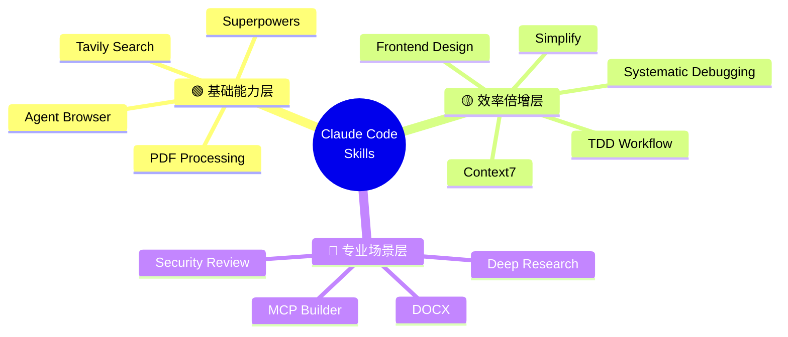
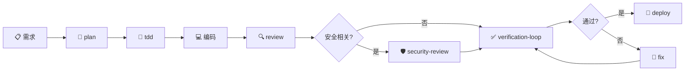

# Skills Dashboard

> 快速查看所有已安装和计划安装的 Claude Code Skills

---

## 全景概览



---

## 已安装 Skills

```dataview
TABLE WITHOUT ID
  file.link AS "Skill",
  tier AS "梯队",
  category AS "分类",
  source AS "来源",
  last_used AS "最后使用"
FROM #type/skill
WHERE status = "installed"
SORT tier ASC, category ASC
```

---

## 待安装 Skills

```dataview
TABLE WITHOUT ID
  file.link AS "Skill",
  tier AS "梯队",
  category AS "分类",
  source AS "来源"
FROM #type/skill
WHERE status = "planned" OR status = "available"
SORT tier ASC
```

---

## 标准开发流程



---

## 快速导航

- [[AI技术/ClaudeCode/使用 Obsidian 可视化 Skills 技能套装指南|可视化指南]] — 6 种可视化方法详解
- [[AI技术/ClaudeCode/Claude Code 必装 Skills 推荐指南|必装推荐]] — 精选 11 个必装 Skills
- [[AI技术/ClaudeCode/Claude Skills，只推荐这 15 个|精选 15 个]] — 三梯队分类法
- [[AI技术/ClaudeCode/Everything-claude-Code/Skills索引|ECC 索引]] — 按功能分类的完整索引
- [[AI技术/ClaudeCode/Skills 可视化画布|可视化画布]] — Canvas 空间布局
