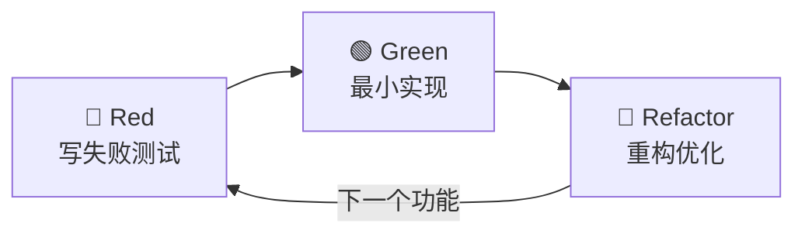

# TDD Workflow

> [!tip|style-yellow] 🧪 TDD Workflow
> **梯队**：效率倍增层 | **来源**：ECC | **状态**：✅ 已安装
>
> **一句话**：强制"先写测试，再写实现"，覆盖率达 80%+

## 核心能力

- 强制执行"先写测试，再写实现"的工作流
- 自动生成测试用例模板
- 确保覆盖率达到 80%+
- 支持 Red → Green → Refactor 循环
- 支持 Jest、Pytest、JUnit、Vitest 等主流框架

## 适用场景

- 新功能开发
- Bug 修复（先写回归测试）
- 代码重构的安全保障

## 安装

```bash
/install-skill tdd-workflow
```

## 关联 Skills

- **前置**：[[context7]] — 确保使用最新 API 编写测试
- **后续**：[[verification-loop]] — TDD 完成后进行全链路验证
- **互补**：[[python-testing]] / [[golang-testing]] — 语言专属测试模式

## 工作流


