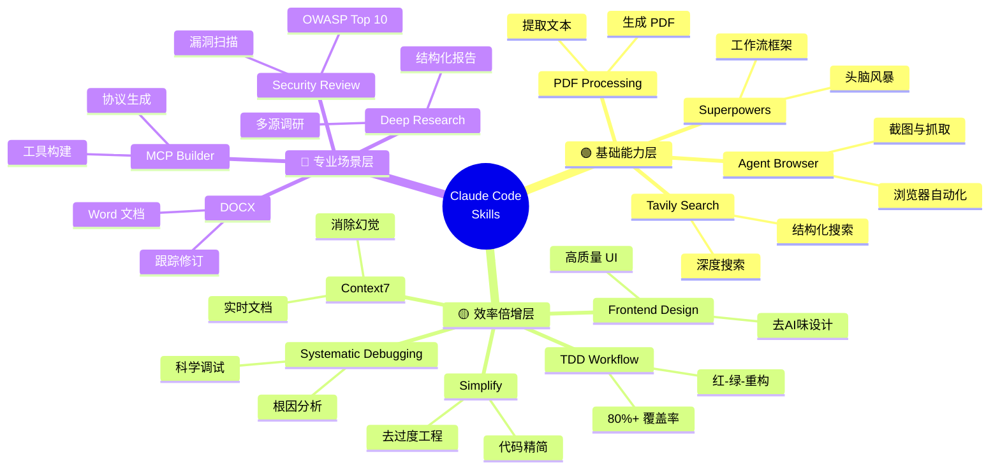
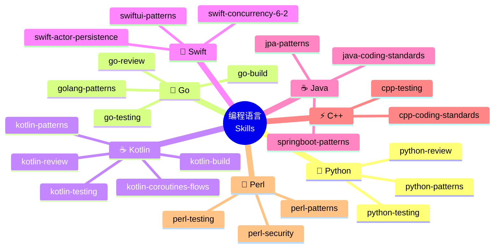
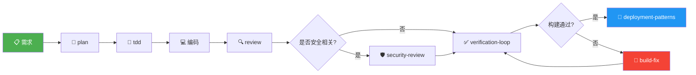
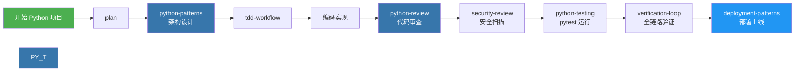
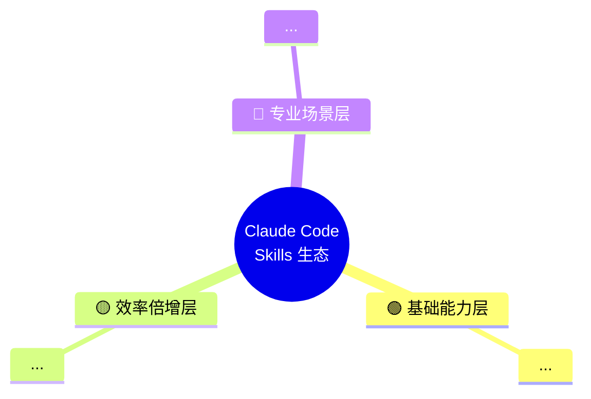

# 使用 Obsidian 可视化 Skills 技能套装

> **副标题**：6 种方法，将 Claude Code 的 Skills 生态变成一眼即懂的知识图谱
> **创建日期**：2026-04-24
> **标签**：#Obsidian #ClaudeCode #Skills #可视化 #知识图谱 #Mermaid #Canvas #Dataview

---

## 目录

- [[#1. 为什么要在 Obsidian 中可视化 Skills]]
- [[#2. 方法一：Mermaid 思维导图 — 全景鸟瞰]]
- [[#3. 方法二：Mermaid 流程图 — 工作链路]]
- [[#4. 方法三：Obsidian Canvas — 空间画布]]
- [[#5. 方法四：Dataview 动态查询 — 自动聚合]]
- [[#6. 方法五：Callout 卡片 — 视觉速查]]
- [[#7. 方法六：Tag + 链接网络 — 关系图谱]]
- [[#8. 实战：构建你的 Skills Dashboard]]
- [[#9. 进阶：与现有笔记体系整合]]
- [[#10. 常见问题]]

---

## 1. 为什么要在 Obsidian 中可视化 Skills

### 1.1 痛点

Claude Code 的 Skills 生态在 2026 年已突破 **20 万+** 个。即使只关注 ECC（Everything Claude Code）的 50+ 核心技能和社区精选的 15 个必装 Skill，面对大量文本列表时：

| 痛点 | 表现 |
|------|------|
| **认知过载** | 一张表列 50+ 个 Skill，看不完也记不住 |
| **关系不明** | Skill 之间如何组合？哪些有依赖关系？ |
| **场景难匹配** | "我现在该用哪个？"——缺乏场景导航 |
| **版本失控** | 装了哪些、更新了哪些、删了哪些，没有全局视图 |

### 1.2 Obsidian 的天然优势

Obsidian 作为「第二大脑」，恰好是解决上述痛点的最佳工具：

```
┌──────────────────────────────────────────────────────────────┐
│                  Obsidian 可视化 Skills 的优势                  │
│                                                              │
│  Mermaid → 内置渲染，代码即图                                  │
│  Canvas  → 空间布局，自由排列                                  │
│  Dataview → 动态查询，自动聚合                                  │
│  Graph   → 关系网络，链接可视化                                 │
│  Callout → 视觉卡片，颜色区分                                  │
│  Tag     → 标签分类，一键筛选                                  │
└──────────────────────────────────────────────────────────────┘
```

> 💡 **核心思路**：不是把 Skills 文档"搬"进 Obsidian，而是用 Obsidian 的可视化能力，构建一个**可交互、可搜索、可演化**的 Skills 知识图谱。

---

## 2. 方法一：Mermaid 思维导图 — 全景鸟瞰

### 2.1 什么是 Mermaid 思维导图

Mermaid 是 Obsidian 内置支持的图表渲染引擎。使用 `mindmap` 类型可以一键生成树状思维导图，无需任何插件。

### 2.2 Skills 全景思维导图

将 Skills 按功能域分类，生成全景视图：



**效果说明**：在 Obsidian 中阅读此笔记时，上述代码块会自动渲染为一张树状思维导图。根节点居中，三大梯队向外辐射，每个 Skill 再展开核心能力。

### 2.3 编程语言 Skills 思维导图

聚焦编程语言生态的可视化：



### 2.4 使用技巧

| 技巧 | 说明 |
|------|------|
| **折叠/展开** | 思维导图支持点击节点折叠/展开子节点 |
| **导出图片** | 右键 Mermaid 图 → 复制为 PNG/SVG |
| **配色** | Mermaid 会自动按层级着色 |
| **嵌入任意笔记** | 复制代码块到任何 `.md` 文件即可渲染 |

---

## 3. 方法二：Mermaid 流程图 — 工作链路

### 3.1 为什么用流程图

思维导图展示「分类」，流程图展示「关系」。Skills 的真正威力在于**组合使用**——流程图能清晰展示 Skill 之间的串联关系。

### 3.2 标准开发流程图

展示从需求到交付的完整 Skill 工作链：



**效果说明**：在 Obsidian 中渲染后，你会看到一个从左到右的流程图。绿色节点代表起点，蓝色代表终点，红色代表错误修复路径。每个节点都是一个 Skill。

### 3.3 Skills 组合效果图

展示不同 Skill 组合产生的协同效应：

```mermaid
flowchart TB
    subgraph 搜索与抓取
        T["🔍 Tavily Search"] -->|找到目标网页| F["🕷️ Firecrawl"]
        F -->|结构化内容| R["📄 Markdown"]
    end

    subgraph 零幻觉开发
        C["📚 Context7"] -->|最新 API 文档| T2["🧪 TDD Workflow"]
        T2 -->|先测试后编码| CODE["💻 代码实现"]
    end

    subgraph 设计闭环
        FD["🎨 Frontend Design"] -->|生成界面| AB["🌐 Agent Browser"]
        AB -->|自动截图| COMPARE["📸 对比验证"]
    end

    subgraph 调研交付
        DR["🔬 Deep Research"] -->|调研报告| DOCX["📝 DOCX"]
        DOCX -->|正式文档| DELIVER["📦 交付"]
    end

    style T fill:#FF9800,color:#fff
    style C fill:#9C27B0,color:#fff
    style FD fill:#E91E63,color:#fff
    style DR fill:#00BCD4,color:#fff
```



### 3.4 按语言的开发流程图

以 Python 项目为例，展示语言专属的 Skill 链：



### 3.5 使用技巧

| 技巧 | 说明 |
|------|------|
| `flowchart LR` | 从左到右排列，适合流程链 |
| `flowchart TB` | 从上到下排列，适合层级关系 |
| `subgraph` | 用子图分组，视觉上区分不同模块 |
| `style` | 自定义节点颜色，用颜色传递语义 |
| `{"条件"}` | 菱形判断节点，表示分支逻辑 |

---

## 4. 方法三：Obsidian Canvas — 空间画布

### 4.1 什么是 Canvas

Obsidian Canvas（白板）是 Obsidian 内置的无限画布功能，可以自由排列卡片、图片、链接和文字，构建空间化的知识布局。

> **核心优势**：Skills 之间的关系不再是线性的，而是二维空间的——你可以自由摆放、连线、分组。

### 4.2 Canvas 可视化 Skills 的布局方案

#### 布局方案 A：分层金字塔

```
┌─────────────────────────────────────────────────────────────────┐
│                                                                 │
│                        ┌─────────────┐                          │
│                        │  Skills 生态  │                          │
│                        └──────┬──────┘                          │
│                               │                                 │
│              ┌────────────────┼────────────────┐                │
│              │                │                │                │
│      ┌───────┴───────┐┌──────┴──────┐┌───────┴───────┐        │
│      │  🟢 基础能力层  ││  🟡 效率层   ││  🔴 专业场景层  │        │
│      └───────┬───────┘└──────┬──────┘└───────┬───────┘        │
│              │                │                │                │
│   ┌──────┬──────┐   ┌──────┬──────┐   ┌──────┬──────┐        │
│   │Agent │Super │   │Front │Ctx7  │   │Deep  │DOCX  │        │
│   │Brow- │power │   │Design│      │   │Rsch  │      │        │
│   │ser   │      │   │      │      │   │      │      │        │
│   └──────┴──────┘   └──────┴──────┘   └──────┴──────┘        │
│                                                                 │
└─────────────────────────────────────────────────────────────────┘
```

#### 布局方案 B：工作流连线图

```
┌──────────────────────────────────────────────────────────────────┐
│                                                                  │
│  [Tavily] ──搜索──▶ [Firecrawl] ──抓取──▶ [Markdown]             │
│                                                                  │
│  [Context7] ──文档──▶ [TDD] ──测试──▶ [代码]                      │
│                                                                  │
│  [Frontend] ──UI──▶ [Browser] ──截图──▶ [验证]                    │
│                                                                  │
│  [Research] ──调研──▶ [DOCX] ──输出──▶ [交付]                     │
│                                                                  │
└──────────────────────────────────────────────────────────────────┘
```

### 4.3 创建 Canvas 的步骤

**Step 1：创建 Canvas 文件**

在 Obsidian 文件管理器中，右键 → 新建 Canvas，命名为 `Skills 可视化画布.canvas`

**Step 2：添加卡片**

每种方法创建一种类型的卡片：

| 卡片类型 | 用途 | 添加方式 |
|----------|------|----------|
| **笔记卡片** | 引用现有 Skills 笔记 | 从左侧文件树拖入 |
| **文字卡片** | 描述 Skill 功能 | 双击画布空白处 |
| **链接卡片** | 指向外部资源 | 添加 → 链接 |
| **图片卡片** | 展示截图/架构图 | 添加 → 图片 |

**Step 3：连线表示关系**

从一个卡片边缘拖向另一个卡片，即可创建连线。可以为连线添加标签：

```
[Tavily Search] ──"搜索结果"──▶ [Firecrawl] ──"结构化内容"──▶ [Deep Research]
```

**Step 4：分组与着色**

选中多个卡片 → 右键 → 设置颜色/分组：

```
🟢 绿色组：基础能力层 Skills
🟡 黄色组：效率倍增层 Skills
🔴 红色组：专业场景层 Skills
```

### 4.4 Canvas 文件结构示例

Canvas 文件是 `.canvas` 后缀的 JSON 文件，结构如下：

```json
{
  "nodes": [
    {
      "id": "node1",
      "type": "text",
      "x": -300,
      "y": -200,
      "width": 250,
      "height": 100,
      "text": "# 🟢 基础能力层\nAgent Browser · Superpowers\nPDF · Tavily Search",
      "color": "4"
    },
    {
      "id": "node2",
      "type": "text",
      "x": 50,
      "y": -200,
      "width": 250,
      "height": 100,
      "text": "# 🟡 效率倍增层\nFrontend Design · Context7\nSystematic Debugging · TDD",
      "color": "2"
    }
  ],
  "edges": [
    {
      "id": "edge1",
      "fromNode": "node1",
      "fromSide": "right",
      "toNode": "node2",
      "toSide": "left",
      "label": "基础打底 → 效率加速"
    }
  ]
}
```

> 💡 **提示**：Canvas 文件可以直接用文本编辑器修改 JSON，也可以在 Obsidian 中可视化操作。

---

## 5. 方法四：Dataview 动态查询 — 自动聚合

### 5.1 什么是 Dataview

Dataview 是 Obsidian 最强大的社区插件之一，可以将 Vault 中的笔记当作数据库进行查询。为每个 Skill 笔记添加 YAML frontmatter 后，就能用 Dataview 自动聚合和可视化。

### 5.2 Step 1：为 Skill 笔记添加 Frontmatter

创建独立的 Skill 笔记，使用统一的 frontmatter 格式：

```markdown
---
type: skill
name: frontend-design
category: 前端与设计
tier: 效率倍增层
source: Anthropic 官方
status: installed
install_date: 2026-03-15
last_used: 2026-04-20
tags:
  - skill/frontend
  - tier/efficiency
---

# Frontend Design

> Anthropic 官方出品，告别"AI 味"设计

## 核心能力
- 生成高质量 HTML/CSS/React 代码
- 内建设计哲学系统（Tailwind + shadcn/ui）
- 避免常见的 AI 设计通病

## 适用场景
- 快速原型、Landing Page、Dashboard UI
```

**每个 Skill 笔记的 Frontmatter 字段说明：**

| 字段 | 类型 | 说明 | 示例值 |
|------|------|------|--------|
| `type` | 文本 | 固定为 `skill` | `skill` |
| `name` | 文本 | Skill 名称 | `frontend-design` |
| `category` | 文本 | 功能分类 | `前端与设计` |
| `tier` | 文本 | 所在梯队 | `基础能力层` / `效率倍增层` / `专业场景层` |
| `source` | 文本 | 来源 | `Anthropic 官方` / `ECC` / `社区` |
| `status` | 文本 | 安装状态 | `installed` / `available` / `planned` |
| `install_date` | 日期 | 安装日期 | `2026-03-15` |
| `last_used` | 日期 | 最后使用日期 | `2026-04-20` |
| `tags` | 列表 | 标签 | `[skill/frontend, tier/efficiency]` |

### 5.3 Step 2：Dataview 查询语句

#### 查询 1：按梯队分组展示所有 Skills

```dataview
TABLE tier AS "梯队", category AS "分类", source AS "来源", status AS "状态"
FROM #type/skill
SORT tier ASC, category ASC
```

**渲染效果预览：**

| 名称 | 梯队 | 分类 | 来源 | 状态 |
|------|------|------|------|------|
| Agent Browser | 基础能力层 | 浏览器自动化 | 社区 | ✅ installed |
| Superpowers | 基础能力层 | 工作流框架 | 社区 | ✅ installed |
| Frontend Design | 效率倍增层 | 前端与设计 | Anthropic 官方 | ✅ installed |
| Context7 | 效率倍增层 | 文档查询 | 社区 | ✅ installed |
| Deep Research | 专业场景层 | 深度调研 | ECC | 📋 planned |

#### 查询 2：按分类统计 Skill 数量

```dataview
TABLE length(rows) AS "数量"
FROM #type/skill
FLATTEN category AS cat
GROUP BY cat
SORT length(rows) DESC
```

#### 查询 3：展示已安装但最近未使用的 Skills

```dataview
TABLE category AS "分类", install_date AS "安装日期", last_used AS "最后使用"
FROM #type/skill
WHERE status = "installed"
SORT last_used ASC
```

#### 查询 4：按语言分组展示编程 Skills

```dataview
TABLE category AS "功能", status AS "状态"
FROM #type/skill
WHERE contains(category, "Python") OR
      contains(category, "Go") OR
      contains(category, "Kotlin") OR
      contains(category, "Swift") OR
      contains(category, "Java") OR
      contains(category, "C++")
SORT category ASC, name ASC
```

### 5.4 可视化 Kanban 看板

结合 Dataview 的 `TASK` 查询，可以创建类似看板的视图：

```dataview
TASK
FROM #type/skill
WHERE !completed
GROUP BY tier
```

**渲染效果**：

```
## 基础能力层
- [ ] 安装 Agent Browser
- [x] 安装 Superpowers
- [x] 安装 PDF Processing

## 效率倍增层
- [x] 安装 Frontend Design
- [x] 安装 Context7
- [ ] 安装 Systematic Debugging

## 专业场景层
- [ ] 安装 Deep Research
- [ ] 安装 DOCX
```

---

## 6. 方法五：Callout 卡片 — 视觉速查

### 6.1 什么是 Callout

Obsidian Callout（标注块）是内置的内容块样式，通过颜色和图标区分不同类型的内容。非常适合制作 Skill 速查卡片。

### 6.2 单个 Skill 卡片

```markdown
> [!skill|style-green] 🎨 Frontend Design
> **梯队**：效率倍增层 | **来源**：Anthropic 官方
>
> **核心能力**：
> - 生成高质量 HTML/CSS/React 代码
> - 内建设计哲学系统（Tailwind + shadcn/ui）
> - 避免常见的 AI 设计通病
>
> **安装**：`/install-skill frontend-design`
> **适用场景**：快速原型、Landing Page、Dashboard UI
>
> > [!tip] 实测评价
> > Reddit 社区公认的"第一个应该安装的 Skill"。装之前 Claude 生成的页面像是 Bootstrap 模板，装之后像是专业设计师的手笔。
```

**渲染效果**：在 Obsidian 中，这会显示为一个绿色卡片，标题带有画笔图标，内部嵌套一个蓝色提示框。

### 6.3 Skill 组合卡片

展示 Skills 协同工作的组合效果：

```markdown
> [!example] 🔄 组合：搜索 → 抓取 → 结构化
>
> ```mermaid
> flowchart LR
>     A["🔍 Tavily<br/>搜索"] --> B["🕷️ Firecrawl<br/>抓取"]
>     B --> C["📄 Markdown<br/>输出"]
> ```
>
> | Skill | 角色 | 效果 |
> |-------|------|------|
> | Tavily Search | 搜索引擎 | 找到目标网页 |
> | Firecrawl | 网页抓取 | 转为结构化内容 |
> | Deep Research | 信息聚合 | 生成调研报告 |
>
> > [!success] 协同效果
> > Tavily 负责找到目标网页 → Firecrawl 负责抓取完整内容 → Deep Research 自动聚合为带引用的报告。
```

### 6.4 按梯队的速查面板

```markdown
> [!note] 🟢 第一梯队：基础能力层（建议全员安装）
> | Skill | 解决的问题 | 安装命令 |
> |-------|-----------|---------|
> | Agent Browser | Claude 无法操作浏览器 | `/install-skill agent-browser` |
> | Superpowers | 缺乏结构化工作流 | `/install-skill superpowers` |
> | PDF Processing | 无法创建/处理 PDF | `/install-skill pdf` |
> | Tavily Search | 搜索结果不够精准 | MCP 配置 |

> [!warning] 🟡 第二梯队：效率倍增层（开发者强烈推荐）
> | Skill | 解决的问题 | 安装命令 |
> |-------|-----------|---------|
> | Frontend Design | AI 生成的 UI 千篇一律 | `/install-skill frontend-design` |
> | Context7 | API 调用幻觉 | `npx context7 --claude` |
> | Systematic Debugging | 调试靠猜效率低 | `/install-skill systematic-debugging` |
> | TDD Workflow | 测试驱动难以贯彻 | `/install-skill tdd-workflow` |
> | Simplify | 过度工程化 | `/install-skill simplify` |

> [!danger] 🔴 第三梯队：专业场景层（按需安装）
> | Skill | 解决的问题 | 安装命令 |
> |-------|-----------|---------|
> | Deep Research | 多源深度调研 | `/install-skill deep-research` |
> | DOCX | 生成 Word 文档 | `/install-skill docx` |
> | Security Review | 安全漏洞检测 | 包含在 ECC 中 |
> | MCP Builder | 自定义工具构建 | `/install-skill mcp-builder` |
```

### 6.5 Skill 评价卡片

```markdown
> [!quote] 💬 社区评价
> **Frontend Design**：
> "没有 Superpowers 的 Claude 像个天才但没有章法的实习生，装了之后变成了有条不紊的高级工程师。" — Reddit
>
> **Context7**：
> "解决 Claude API 幻觉的终极方案。" — Addy Osmani (Google)
>
> **Simplify**：
> "被严重低估的 Skill。Claude 给你造一架飞机，而你只需要一辆自行车。" — Reddit
```

---

## 7. 方法六：Tag + 链接网络 — 关系图谱

### 7.1 利用 Obsidian 图谱视图

Obsidian 内置的**图谱视图**（Graph View）会自动将笔记之间的 `[[双链]]` 关系可视化为网络图。通过合理设置标签和链接，可以让 Skills 在图谱中自然形成聚类。

### 7.2 Step 1：建立标签体系

为每个 Skill 笔记设置统一的标签：

```yaml
---
tags:
  - skill
  - skill/frontend       # 按功能域
  - tier/efficiency      # 按梯队
  - lang/typescript      # 按语言（如适用）
  - source/official      # 按来源
---
```

**标签体系设计**：

| 标签前缀 | 含义 | 示例 |
|----------|------|------|
| `skill/` | 功能域 | `skill/frontend`, `skill/security`, `skill/testing` |
| `tier/` | 梯队 | `tier/basic`, `tier/efficiency`, `tier/professional` |
| `lang/` | 编程语言 | `lang/python`, `lang/go`, `lang/kotlin` |
| `source/` | 来源 | `source/official`, `source/ecc`, `source/community` |
| `status/` | 状态 | `status/installed`, `status/planned`, `status/available` |

### 7.3 Step 2：建立双向链接

在 Skill 笔记之间建立有意义的链接：

```markdown
# Context7

> 实时拉取最新版本的库/框架文档

## 关联 Skills

- **互补**：[[TDD Workflow]] — 用最新 API 文档写测试，零幻觉
- **前置**：[[Frontend Design]] — 确保使用最新版本的 Tailwind/shadcn
- **协同**：[[Deep Research]] — Context7 提供实时文档，Deep Research 聚合分析
- **替代**：取代手动查阅文档的习惯

## 工作流位置


```

### 7.4 Step 3：图谱视图效果

建立链接后，在 Obsidian 图谱视图中：

```
                    ┌── Frontend Design ──┐
                    │                     │
            Context7 ────── TDD Workflow ─┤
               │                          │
               └── Deep Research ─── DOCX │
                    │                     │
            Tavily ─── Firecrawl ─────────┘
               │
            Superpowers ──── Systematic Debugging
               │                     │
            Plan ────────── Verification Loop
```

**图谱中的视觉特征**：

| 特征 | 含义 |
|------|------|
| **大节点** | 被多个笔记链接的核心 Skill（如 Context7、TDD） |
| **密集连线** | 互相引用的 Skill 组合（如 Tavily + Firecrawl） |
| **孤立节点** | 尚未建立关联的 Skill（需要补充链接） |
| **聚类** | 同类 Skills 自然形成群组（如编程语言 Skills） |

### 7.5 局部图谱过滤

Obsidian 支持按标签过滤图谱，实现按维度的可视化：

- 输入 `tag:#tier/basic` → 只显示基础能力层 Skills
- 输入 `tag:#lang/python` → 只显示 Python 相关 Skills
- 输入 `tag:#source/official` → 只显示 Anthropic 官方 Skills

---

## 8. 实战：构建你的 Skills Dashboard

### 8.1 Dashboard 笔记结构

创建一个 `Skills Dashboard.md`，将上述所有可视化方法整合到一个笔记中：

```markdown
---
aliases: [Skills 仪表盘, Skills Dashboard]
tags: [dashboard, skills]
---

# Skills Dashboard

## 全景概览



## 安装状态

```dataview
TABLE status AS "状态", tier AS "梯队", category AS "分类"
FROM #type/skill
SORT tier ASC
```

## 工作流导航


## 速查卡片

> [!note] 🟢 基础能力层
> ...

> [!warning] 🟡 效率倍增层
> ...

## 待办事项

```dataview
TASK
FROM #type/skill
WHERE !completed
```

## 相关链接

- [[AI技术/ClaudeCode/Claude Code 必装 Skills 推荐指南|必装 Skills 推荐]]
- [[AI技术/ClaudeCode/Claude Skills，只推荐这 15 个|精选 15 个 Skills]]
- [[AI技术/ClaudeCode/Everything-claude-Code/Skills索引|ECC Skills 索引]]
```

### 8.2 推荐的文件结构

```
AI技术/ClaudeCode/
├── Skills/
│   ├── _Dashboard.md              ← 仪表盘总览
│   ├── _Canvas.canvas             ← 空间画布
│   ├── frontend-design.md         ← 单个 Skill 笔记
│   ├── context7.md
│   ├── tdd-workflow.md
│   ├── deep-research.md
│   ├── ... (其他 Skill 笔记)
│   └── 组合方案/
│       ├── 搜索抓取链.md
│       ├── 零幻觉开发链.md
│       └── 设计闭环链.md
├── Claude Code 必装 Skills 推荐指南.md
├── Claude Skills，只推荐这 15 个.md
├── 使用 Obsidian 可视化 Skills 技能套装指南.md  ← 本指南
└── Everything-claude-Code/
    ├── Skills索引.md
    └── 快速参考卡片.md
```

---

## 9. 进阶：与现有笔记体系整合

### 9.1 与现有指南笔记的双向链接

在已有笔记中添加对 Skill 笔记的引用：

**在 [[AI技术/ClaudeCode/Claude Code 必装 Skills 推荐指南|必装推荐指南]] 中添加**：

```markdown
> [!info] 🗺️ 可视化入口
> 想要全景可视化查看所有 Skills？→ [[AI技术/ClaudeCode/Skills/_Dashboard|Skills Dashboard]]
```

**在单个 Skill 笔记中添加**：

```markdown
> [!tip] 相关指南
> - 完整推荐列表：[[AI技术/ClaudeCode/Claude Code 必装 Skills 推荐指南]]
> - ECC 索引：[[AI技术/ClaudeCode/Everything-claude-Code/Skills索引]]
> - 可视化指南：[[AI技术/ClaudeCode/使用 Obsidian 可视化 Skills 技能套装指南]]
```

### 9.2 快速创建 Skill 笔记的模板

在 Obsidian 模板文件夹中创建 `Skill 模板.md`：

```markdown
---
type: skill
name: "{{title}}"
category: ""
tier: ""
source: ""
status: planned
install_date: {{date}}
last_used:
tags:
  - type/skill
---

# {{title}}

> [!skill] {{title}}
> **梯队**：`tier` | **来源**：`source` | **状态**：`status`

## 核心能力

-

## 适用场景

-

## 安装命令

```bash
/install-skill {{title}}
```

## 关联 Skills

- **互补**：`[[]]`
- **前置**：`[[]]`
- **替代**：`[[]]`

## 工作流位置


## 实测评价

> [!quote] 评价
> （使用后填写）
```

### 9.3 自动化：用 Templater 批量创建

如果安装了 Templater 插件，可以批量创建 Skill 笔记：

```markdown
<%*
const skills = [
  { name: "frontend-design", category: "前端与设计", tier: "效率倍增层", source: "Anthropic 官方" },
  { name: "context7", category: "文档查询", tier: "效率倍增层", source: "社区" },
  { name: "tdd-workflow", category: "测试", tier: "效率倍增层", source: "ECC" },
  // ... 添加更多
];

for (const skill of skills) {
  const content = `---
type: skill
name: "${skill.name}"
category: "${skill.category}"
tier: "${skill.tier}"
source: "${skill.source}"
status: planned
tags:
  - type/skill
---

# ${skill.name}

> 核心能力：待补充
`;
  await tp.file.create_new(content, skill.name, true, "AI技术/ClaudeCode/Skills/");
}
tR += `✅ 已创建 ${skills.length} 个 Skill 笔记`;
%>
```

---

## 10. 常见问题

### Q1：需要安装哪些 Obsidian 插件？

> | 功能 | 是否需要插件 | 说明 |
> |------|------------|------|
> | Mermaid 图表 | ❌ 不需要 | Obsidian 内置支持 |
> | Canvas 画布 | ❌ 不需要 | Obsidian 内置支持 |
> | 图谱视图 | ❌ 不需要 | Obsidian 内置支持 |
> | Callout 标注 | ❌ 不需要 | Obsidian 内置支持 |
> | Dataview 查询 | ✅ 需要安装 | 社区插件，搜索 "Dataview" |
> | Templater 模板 | ✅ 需要安装 | 社区插件，搜索 "Templater"（可选） |

### Q2：6 种方法应该选哪个？

> | 场景 | 推荐方法 | 理由 |
> |------|---------|------|
> | 快速全览 | Mermaid 思维导图 | 一张图看清全貌 |
> | 理解工作流 | Mermaid 流程图 | 清晰展示 Skill 链路 |
> | 自由布局 | Canvas 画布 | 空间排列最灵活 |
> | 动态跟踪 | Dataview 查询 | 数据变化自动更新 |
> | 视觉速查 | Callout 卡片 | 颜色区分最直观 |
> | 关系探索 | 图谱视图 | 发现隐藏关联 |

### Q3：Skill 笔记太多会不会影响 Vault 性能？

> 不会。Obsidian 可以轻松管理数千个笔记。50-100 个 Skill 笔记对性能几乎无影响。建议使用文件夹 + 标签保持结构清晰。

### Q4：Dataview 查询不显示结果怎么办？

> 1. 确认已安装 Dataview 插件并启用
> 2. 确认 Skill 笔记的 frontmatter 中有 `type: skill` 字段
> 3. 确认使用了 ````dataview` 而不是 ````query`（两者语法不同）
> 4. 检查标签是否正确（Dataview 的 `FROM` 语法区分大小写）

### Q5：Mermaid 图表不渲染怎么办？

> 1. 确认使用的是 **三个反引号** + `mermaid` 的代码块
> 2. 确认 Obsidian 设置中「Markdown → 展开 Mermaid 图表」已启用
> 3. 检查 Mermaid 语法是否有误（括号、引号、逗号等）
> 4. 尝试在 Obsidian 的「阅读视图」中查看

---

## 6 种方法对比总结

| 维度 | Mermaid 思维导图 | Mermaid 流程图 | Canvas 画布 | Dataview 查询 | Callout 卡片 | 图谱视图 |
|------|:---:|:---:|:---:|:---:|:---:|:---:|
| **上手难度** | ⭐ | ⭐⭐ | ⭐ | ⭐⭐⭐ | ⭐ | ⭐ |
| **信息密度** | ⭐⭐⭐⭐ | ⭐⭐⭐ | ⭐⭐⭐ | ⭐⭐⭐⭐⭐ | ⭐⭐⭐ | ⭐⭐ |
| **动态更新** | ❌ 手动 | ❌ 手动 | ❌ 手动 | ✅ 自动 | ❌ 手动 | ✅ 自动 |
| **美观度** | ⭐⭐⭐⭐ | ⭐⭐⭐⭐ | ⭐⭐⭐⭐⭐ | ⭐⭐⭐ | ⭐⭐⭐⭐ | ⭐⭐⭐ |
| **展示关系** | 分类 | 流程 | 自由 | 结构化 | 视觉 | 网络 |
| **需要插件** | ❌ | ❌ | ❌ | ✅ | ❌ | ❌ |
| **可导出** | ✅ PNG | ✅ PNG | ✅ PNG | ❌ | ✅ PDF | ✅ PNG |

> 💡 **最佳实践**：组合使用多种方法。用 **Mermaid 思维导图**做全览，**流程图**展示工作流，**Dataview**跟踪状态，**Callout**做速查卡片。互为补充，构建完整的 Skills 可视化体系。

---

## 参考资源

- [[AI技术/ClaudeCode/Claude Code 必装 Skills 推荐指南|Claude Code 必装 Skills 推荐]] — 精选 11 个必装 Skills
- [[AI技术/ClaudeCode/Claude Skills，只推荐这 15 个|实测 200+ Skills，只推荐这 15 个]] — 三梯队分类法
- [[AI技术/ClaudeCode/Everything-claude-Code/Skills索引|ECC Skills 索引]] — 按功能分类的完整索引
- [[AI技术/ClaudeCode/Everything-claude-Code/快速参考卡片|ECC 快速参考卡片]] — 打印级速查
- [Obsidian Mermaid 文档](https://help.obsidian.md/Editing+and+formatting/Advanced+formatting+syntax#Mermaid)
- [Obsidian Canvas 文档](https://help.obsidian.md/Canvas+-+Obsidian+Markdown)
- [Dataview 插件文档](https://blacksmithgu.github.io/obsidian-dataview/)

---

*创建日期：2026-04-24 · 大雄 & Claudian 合著*
