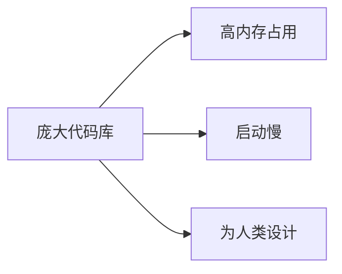
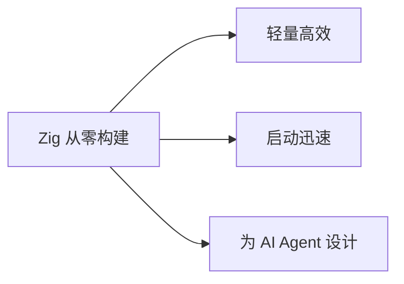

# Lightpanda 介绍与集成指南

## 📋 目录
- [什么是 Lightpanda](#什么是-lightpanda)
- [核心特性](#核心特性)
- [与传统浏览器的对比](#与传统浏览器的对比)
- [Claude/MCP 集成](#claudemcp-集成)
- [OpenClaw 集成](#openclaw-集成)
- [快速开始](#快速开始)
- [代码示例](#代码示例)
- [参考资源](#参考资源)

---

## 什么是 Lightpanda

**Lightpanda** 是一个专为 AI Agent 设计的开源无头浏览器（Headless Browser）。与传统基于 Chromium 的浏览器不同，Lightpanda 使用 **Zig** 编程语言从零构建，专门优化了 LLM（大语言模型）的使用场景。

### 核心定位
- 🤖 **AI Native**：专为 LLM Agent 和自动化任务设计
- ⚡ **极致性能**：比 Chrome 快 11 倍，内存占用减少 9 倍
- 🔌 **协议兼容**：支持 CDP（Chrome DevTools Protocol）、Playwright、Puppeteer
- 🌐 **轻量级**：不依赖庞大的 Chromium 代码库

---

## 核心特性

### 1. 性能优势
| 指标 | Chrome | Lightpanda | 提升 |
|------|--------|------------|------|
| 启动速度 | 慢 | 快 | **11x** |
| 内存占用 | 高 | 低 | **-9x** |
| CPU 使用 | 高 | 低 | 显著降低 |

### 2. 技术架构
- **语言**: Zig（系统级编程语言，性能媲美 C/C++）
- **架构**: 独立实现，非 Chromium fork
- **协议**: 完整 CDP 支持

### 3. 使用场景
- 📊 **Web 数据提取**: 爬虫、数据采集
- 🤖 **AI Agent 浏览器**: LLM 与网页交互
- 🧪 **自动化测试**: E2E 测试替代方案
- 📚 **LLM 训练数据生成**: 大规模网页内容处理

---

## 与传统浏览器的对比

### Chrome/Chromium


### Lightpanda


---

## Claude/MCP 集成

### 什么是 MCP
MCP (Model Context Protocol) 是 Claude 的扩展协议，允许 AI 模型与外部工具和服务进行结构化交互。

### 集成方式

#### 方案一：使用官方 Agent Skill
GitHub 仓库：[lightpanda-io/agent-skill](https://github.com/lightpanda-io/agent-skill)

**安装步骤：**

1. **克隆仓库**
```bash
git clone https://github.com/lightpanda-io/agent-skill.git
cd agent-skill
```

2. **配置 MCP Server**
在 Claude Code 配置文件 (`.claude/config.json`) 中添加：

```json
{
  "mcpServers": {
    "lightpanda": {
      "command": "node",
      "args": ["path/to/agent-skill/dist/index.js"],
      "env": {
        "LIGHTPANDA_URL": "http://localhost:3000"
      }
    }
  }
}
```

3. **启动 Lightpanda 服务**
```bash
# 使用 Docker
docker run -p 3000:3000 lightpanda/lightpanda:latest

# 或本地编译
git clone https://github.com/lightpanda-io/lightpanda.git
cd lightpanda
zig build run
```

#### 方案二：直接使用 Playwright 适配器

Lightpanda 支持 Playwright 协议，可直接替换浏览器引擎：

```javascript
import { chromium } from 'playwright';

// 指向 Lightpanda 服务
const browser = await chromium.connect('http://localhost:3000');
const page = await browser.newPage();
await page.goto('https://example.com');
```

---

## OpenClaw 集成

### OpenClaw 简介
OpenClaw 是一个通用的浏览器自动化工具，支持 Chrome DevTools Protocol (CDP)。

### 集成步骤

#### 1. 安装 Lightpanda
```bash
# 使用 Docker (推荐)
docker pull lightpanda/lightpanda:latest
docker run -d -p 9222:9222 lightpanda/lightpanda

# 或从源码编译
git clone https://github.com/lightpanda-io/lightpanda.git
cd lightpanda
zig build
```

#### 2. 配置 OpenClaw 使用 Lightpanda

在 OpenClaw 的浏览器配置中，将默认浏览器替换为 Lightpanda：

```python
# OpenClaw 配置示例
BROWSER_CONFIG = {
    "type": "cdp",
    "endpoint": "http://localhost:9222",  # Lightpanda CDP 端点
    "headless": True
}
```

#### 3. 作为 Chrome 的直接替代品

Lightpanda 可以作为 Chrome 和 OpenClaw 默认浏览器的"直接替代品"：

```bash
# 原始命令（使用 Chrome）
openclaw --browser chrome

# 替换为 Lightpanda
openclaw --browser cdp --browser-url http://localhost:9222
```

---

## 快速开始

### 前置要求
- Docker 或 Zig 编译器
- Node.js 18+ (用于使用 Playwright/Puppeteer)
- Python 3.8+ (用于 OpenClaw)

### 五分钟启动

#### Step 1: 启动 Lightpanda
```bash
docker run -d -p 9222:9222 --name lightpanda lightpanda/lightpanda:latest
```

#### Step 2: 验证连接
```bash
curl http://localhost:9222/json/version
```

期望输出：
```json
{
  "Browser": "Lightpanda",
  "Protocol-Version": "1.3",
  "webSocketDebuggerUrl": "ws://localhost:9222/..."
}
```

#### Step 3: 使用 Playwright 连接
```javascript
const { chromium } = require('playwright');

(async () => {
  const browser = await chromium.connect('ws://localhost:9222');
  const page = await browser.newPage();
  await page.goto('https://example.com');
  console.log(await page.title());
  await browser.close();
})();
```

---

## 代码示例

### 示例 1: Claude Agent 使用 Lightpanda 网页浏览

```python
import anthropic
from playwright.async_api import async_playwright

client = anthropic.Anthropic()

async def browse_with_claud():
    async with async_playwright() as p:
        # 连接到 Lightpanda
        browser = await p.chromium.connect('ws://localhost:9222')
        page = await browser.new_page()

        # 导航到目标页面
        await page.goto('https://example.com')

        # 提取页面内容
        content = await page.content()

        # 发送给 Claude 分析
        message = client.messages.create(
            model="claude-3-opus-20240229",
            max_tokens=1024,
            messages=[{
                "role": "user",
                "content": f"分析这个页面的主要内容：\n\n{content[:10000]}"
            }]
        )

        print(message.content)
        await browser.close()
```

### 示例 2: OpenClaw 自动化任务

```python
from openclaw import BrowserAgent

agent = BrowserAgent(
    browser_url="http://localhost:9222",  # Lightpanda
    headless=True
)

# 执行自动化任务
result = agent.navigate_and_extract(
    url="https://example.com",
    extract_selectors={
        "title": "h1",
        "description": "meta[name='description']",
        "links": "a[href]"
    }
)

print(result)
```

### 示例 3: 大规模数据采集

```javascript
// 使用 Lightpanda 的性能优势
const { chromium } = require('playwright');

async function scrape_multiple(urls) {
  const browser = await chromium.connect('ws://localhost:9222');
  const context = await browser.newContext();

  // 并发处理多个页面
  const results = await Promise.all(
    urls.map(async (url) => {
      const page = await context.newPage();
      await page.goto(url);
      const data = await page.evaluate(() => ({
        title: document.title,
        text: document.body.innerText
      }));
      await page.close();
      return { url, ...data };
    })
  );

  await browser.close();
  return results;
}
```

---

## 参考资源

### 官方资源
- **Lightpanda GitHub**: https://github.com/lightpanda-io/lightpanda
- **Agent Skill**: https://github.com/lightpanda-io/agent-skill
- **文档**: https://docs.lightpanda.io

### 协议标准
- **Chrome DevTools Protocol**: https://chromedevtools.github.io/devtools-protocol/
- **Playwright**: https://playwright.dev/
- **Puppeteer**: https://pptr.dev/

### 相关工具
- **Claude Code**: https://claude.ai/code
- **OpenClaw**: https://openclaw.dev/
- **LobeHub Skills**: https://github.com/lobehub/skills-marketplace

---

## 总结

Lightpanda 是下一代 AI Agent 浏览器解决方案，通过其卓越的性能和轻量级设计，为 Claude、OpenClaw 等工具提供了高效的网页交互能力。

### 选择 Lightpanda 的理由
✅ **性能**: 11x 速度提升，9x 内存节省
✅ **兼容**: 完全支持 CDP/Playwright/Puppeteer
✅ **现代**: 为 AI Agent 设计，非人类浏览器改造
✅ **开源**: 完全开源，社区驱动

### 适用场景推荐
| 场景 | 推荐工具 | 理由 |
|------|---------|------|
| Claude MCP 集成 | Agent Skill | 官方支持，开箱即用 |
| OpenClaw 自动化 | CDP 连接 | 协议兼容，无缝切换 |
| 大规模爬虫 | Playwright + Lightpanda | 性能优势明显 |
| 本地开发 | Docker 部署 | 快速启动，易于管理 |
