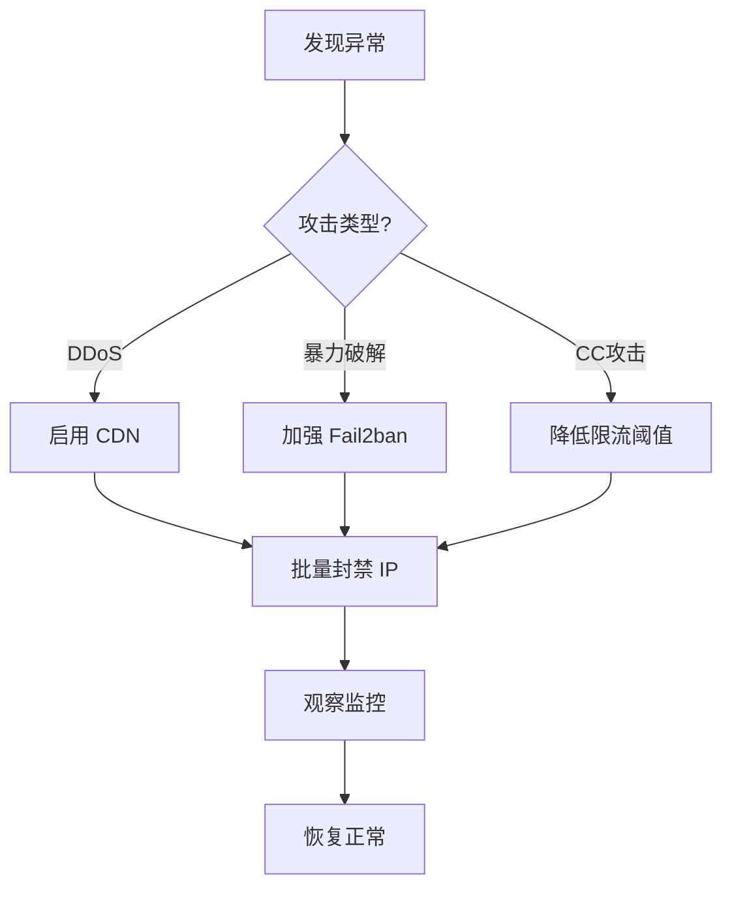

# 网站防护教程：防止攻击与流量冲击

> **环境**: OpenResty + 1Panel + Fail2ban
> **特点**: 1Panel 简化管理 + OpenResty 强大扩展能力

---

## 🎯 一、快速开始（正确的配置路径）

### 1.1 1Panel 实际功能说明

**注意**: 1Panel 没有"安全"标签和"访问限流"模块。

**1Panel 网站设置实际包含**:
| 功能 | 说明 | 是否用于防攻击 |
|-----|------|--------------|
| **流量限制** | 控制带宽/下载流量 | ❌ 不是请求频率限制 |
| **防盗链** | 防止资源被其他网站引用 | ✅ 可用 |
| **密码访问** | 网站访问需密码 | ⚠️ 仅基础保护 |
| **HTTPS** | SSL 证书配置 | ✅ 必须 |
| **配置文件** | 编辑 nginx 配置 | ✅ **核心入口** |

### 1.2 正确的防护配置流程


**关键路径**:
```
1Panel → 网站 → 选择网站 → 配置文件 → 编辑 nginx 配置
```

---

## 二、Fail2ban 核心配置

### 2.1 通过 1Panel 安装 Fail2ban

```
1Panel 面板 → 应用商店 → 搜索 "Fail2ban" → 安装
```

**安装后的日志路径**:
```bash
# 1Panel 管理的 OpenResty 日志
/opt/1panel/apps/openresty/openresty/logs/

# 或标准 OpenResty 日志
/usr/local/openresty/nginx/logs/
```

### 2.2 通过 1Panel 编辑 Fail2ban 配置

```
应用 → 已安装 → Fail2ban → 配置编辑
```

找到 `jail.d/` 目录，创建或编辑 `website-protection.conf`:

```ini
[DEFAULT]
# 封禁时间（秒）
bantime = 3600

# 检测时间窗口（秒）
findtime = 600

# 触发阈值
maxretry = 10

# 忽略IP（白名单）
ignoreip = 127.0.0.1/8 ::1

# ========== OpenResty 限流检测 ==========
[openresty-req-limit]
enabled = true
filter = nginx-req-limit
action = iptables-multiport[name=ReqLimit, port="http,https", protocol=tcp]
logpath = /opt/1panel/apps/openresty/openresty/logs/*error.log
         /usr/local/openresty/nginx/logs/*error.log
maxretry = 5
findtime = 60
bantime = 1800

# ========== OpenResty 恶意扫描 ==========
[openresty-badbots]
enabled = true
filter = nginx-badbots
action = iptables-multiport[name=BadBots, port="http,https", protocol=tcp]
logpath = /opt/1panel/apps/openresty/openresty/logs/*access.log
         /usr/local/openresty/nginx/logs/*access.log
maxretry = 2
findtime = 600
bantime = 86400

# ========== OpenResty 404 扫描 ==========
[openresty-noscript]
enabled = true
filter = nginx-noscript
action = iptables-multiport[name=NoScript, port="http,https", protocol=tcp]
logpath = /opt/1panel/apps/openresty/openresty/logs/*access.log
         /usr/local/openresty/nginx/logs/*access.log
maxretry = 3
findtime = 300
bantime = 7200

# ========== SSH 保护 ==========
[sshd]
enabled = true
port = ssh
filter = sshd
logpath = /var/log/auth.log
maxretry = 3
findtime = 300
bantime = 3600
```

### 2.3 创建自定义过滤器

在 1Panel 中:
```
应用 → Fail2ban → 配置编辑 → filter.d/nginx-req-limit.conf
```

```ini
[Definition]
failregex = limiting requests, excess:.* by zone.*client: <HOST>
            limiting requests, exceed.* by zone.*client: <HOST>
            [error] \d+#\d+: \*\d+ limiting requests.*client: <HOST>
ignoreregex =
```

### 2.4 重启并验证

```
应用 → Fail2ban → 重启
```

或在终端执行:
```bash
# 查看状态
fail2ban-client status

# 查看特定 jail 状态
fail2ban-client status openresty-req-limit

# 解封 IP
fail2ban-client set openresty-req-limit unbanip 1.2.3.4
```

---

## 三、OpenResty 限流配置（通过 1Panel 编辑）

### 3.1 通过 1Panel 编辑 nginx 配置

```
1Panel → 网站 → 选择网站 → 配置文件
```

找到 `http` 块，添加限流配置：

```nginx
http {
    # ========== 限流区域定义 ==========
    # 基于 IP 的限流：每秒 10 个请求
    limit_req_zone $binary_remote_addr zone=general_limit:10m rate=10r/s;

    # 登录接口严格限流：每秒 3 个请求
    limit_req_zone $binary_remote_addr zone=login_limit:10m rate=3r/s;

    # 并发连接限制
    limit_conn_zone $binary_remote_addr zone=conn_limit:10m;

    server {
        listen 80;
        server_name example.com;

        # 全局并发连接限制：单IP最多5个连接
        limit_conn conn_limit 5;

        # 全局请求速率限制
        limit_req zone=general_limit burst=20 nodelay;

        # 自定义限流响应
        limit_req_status 429;

        # 网站根目录
        root /www/wwwroot/example.com;
        index index.html index.php;

        # 登录接口特殊限制
        location /admin/login {
            limit_req zone=login_limit burst=5 nodelay;
            # ... 其他配置
        }

        # API 接口限制
        location /api/ {
            limit_req zone=login_limit burst=10 nodelay;
            # ... 其他配置
        }

        # 自定义 429 响应页面
        error_page 429 /429.html;
        location = /429.html {
            return 429 '{"error": "Too many requests, please slow down"}';
            add_header Content-Type application/json;
        }
    }
}
```

### 3.2 限流参数说明

| 参数 | 说明 | 推荐值 |
|-----|------|-------|
| `rate` | 每秒请求数 | 普通页面 10r/s，API 3-5r/s |
| `burst` | 突发缓冲区 | rate 的 2-3 倍 |
| `nodelay` | 不延迟处理 burst | 生产环境必须开启 |
| `zone=...:10m` | 共享内存大小 | 1M 可存约 1.6万 个IP |

### 3.3 IP 黑名单配置

在 `http` 块中添加：

```nginx
http {
    # ========== IP 黑名单 ==========
    geo $blocked_ips {
        default 0;
        1.2.3.4 1;        # 单个 IP
        5.6.0.0/16 1;     # IP 段
    }

    server {
        # 黑名单直接返回 403
        if ($blocked_ips) {
            return 403 "Your IP has been blocked";
        }

        # 其他配置...
    }
}
```

### 3.4 User-Agent 过滤

```nginx
http {
    # 屏蔽恶意爬虫和空 UA
    map $http_user_agent $blocked_ua {
        default 0;
        ~*(?:curl|wget|python|scanner|hack) 1;
        ~*(?:spider|crawler|bot|scan) 1;
        "" 1;                                  # 空 UA
        ~*^-?$ 1;                              # 只有横线
    }

    server {
        if ($blocked_ua) {
            return 403 "Forbidden User-Agent";
        }

        # 其他配置...
    }
}
```

---

## 四、OpenResty Lua 高级限流（更强大）

### 4.1 创建 Lua 限流脚本

通过 1Panel 或终端创建文件：

```bash
# 路径示例
mkdir -p /opt/1panel/apps/openresty/openresty/lua
nano /opt/1panel/apps/openresty/openresty/lua/rate_limit.lua
```

```lua
-- rate_limit.lua
local redis = require "resty.redis"
local red = redis:new()

red:set_timeout(1000)

local ok, err = red:connect("127.0.0.1", 6379)
if not ok then
    ngx.log(ngx.ERR, "Redis connection failed: ", err)
    return
end

local client_ip = ngx.var.remote_addr
local key = "rate_limit:" .. client_ip

-- 递增计数
local requests, err = red:incr(key)

if requests == 1 then
    red:expire(key, 60)  -- 60 秒窗口
end

-- 限流：1 分钟最多 100 次
if requests > 100 then
    ngx.status = 429
    ngx.say("Too many requests")
    ngx.exit(429)
end
```

### 4.2 在 nginx.conf 中调用

```nginx
http {
    lua_shared_dict limit_counter 10m;
    lua_package_path "/opt/1panel/apps/openresty/openresty/lua/?.lua;;";

    server {
        location / {
            access_by_lua_block {
                require("rate_limit")
            }
        }
    }
}
```

---

## 五、一键部署 WAF（推荐方案）

### 5.1 安装雷池 SafeLine WAF

```
1Panel → 应用商店 → 搜索 "雷池" 或 "SafeLine" → 安装
```

**雷池 WAF 功能**:
- ✅ 自动防护 SQL 注入、XSS、CC 攻击
- ✅ 图形化管理界面
- ✅ 实时攻击日志分析
- ✅ 一键封禁恶意 IP

### 5.2 配置 WAF 代理

安装后，将网站流量经过 WAF：

```nginx
server {
    listen 80;
    server_name example.com;

    # 反向代理到 WAF（端口根据实际安装调整）
    location / {
        proxy_pass http://127.0.0.1:9443;
        proxy_set_header Host $host;
        proxy_set_header X-Real-IP $remote_addr;
    }
}
```

---

## 六、监控与诊断

### 6.1 1Panel 内置监控

```
网站 → 选择网站 → 监控
```

### 6.2 快速诊断命令

```bash
# 查看当前连接最多的 IP
netstat -ntu | awk '{print $5}' | cut -d: -f1 | sort | uniq -c | sort -nr | head -20

# 查看 OpenResty 状态（需启用 stub_status）
curl http://localhost/nginx_status

# 实时查看错误日志
tail -f /opt/1panel/apps/openresty/openresty/logs/error.log

# 查看 Fail2ban 封禁状态
fail2ban-client status openresty-req-limit
```

---

## 七、应急响应流程

### 攻击处理流程



### 快速应急操作

| 紧急情况 | 操作 |
|---------|------|
| 网站被刷 | 编辑 nginx 配置，降低 `rate` 值为 `1r/s` |
| 恶意 IP | 在 `geo $blocked_ips` 中添加 |
| 暴力破解 | Fail2ban 降低 `maxretry` 为 `2` |
| 流量暴增 | 启用 Cloudflare CDN |

### 快速命令

```bash
# 立即封禁单个 IP
iptables -A INPUT -s 1.2.3.4 -j DROP

# 封禁 IP 段
iptables -A INPUT -s 1.2.3.0/24 -j DROP

# 查看封禁列表
iptables -L INPUT -n -v | grep DROP

# 解除封禁
iptables -D INPUT -s 1.2.3.4 -j DROP

# 重载 OpenResty（不中断服务）
openresty -s reload

# Fail2ban 手动封禁
fail2ban-client set openresty-req-limit banip 1.2.3.4

# Fail2ban 解封
fail2ban-client set openresty-req-limit unbanip 1.2.3.4
```

---

## 八、推荐配置方案

### 方案 A：小流量网站（推荐）

| 功能 | 配置方式 |
|-----|---------|
| 请求限流 | nginx 配置 `limit_req` |
| IP 黑名单 | nginx `geo` 模块 |
| Fail2ban | 1Panel 商店安装 |
| HTTPS | 1Panel 内置 Let's Encrypt |
| CDN | Cloudflare 免费版 |

### 方案 B：中流量网站

| 功能 | 配置方式 |
|-----|---------|
| 智能限流 | OpenResty + Redis Lua 脚本 |
| WAF | 雷池 SafeLine |
| 监控 | 1Panel 内置监控 |
| CDN | 阿里云/腾讯云 CDN |

### 方案 C：高防网站

| 功能 | 配置方式 |
|-----|---------|
| DDoS 防护 | 高防 IP / 高防 CDN |
| WAF | 雷池企业版 |
| 监控 | Grafana + Prometheus |

---

## 九、配置检查清单

### 基础防护
- [ ] Fail2ban 已安装（1Panel 商店）
- [ ] nginx 限流已配置（配置文件编辑）
- [ ] SSL 证书已启用
- [ ] 隐藏服务器版本信息

### 高级防护
- [ ] Lua 限流脚本已部署（可选）
- [ ] WAF 已安装（雷池 SafeLine）
- [ ] 监控已配置
- [ ] 备份计划已设置

---

## 十、常见问题

### Q1: 1Panel 日志路径在哪里？

```bash
# 1Panel OpenResty 默认路径
/opt/1panel/apps/openresty/openresty/logs/
```

### Q2: 如何查看实时日志？

```bash
# 方式一：终端
tail -f /opt/1panel/apps/openresty/openresty/logs/access.log

# 方式二：1Panel 界面
网站 → 选择网站 → 日志
```

### Q3: 配置修改后如何生效？

```bash
# 方式一：1Panel 界面
网站 → 配置文件 → 保存后自动重载

# 方式二：命令行
openresty -s reload
```

### Q4: 如何批量封禁 IP？

在 nginx 配置中：
```nginx
geo $blocked_ips {
    default 0;
    1.2.3.4 1;
    5.6.7.8 1;
    9.10.0.0/16 1;
}
```

---

## 参考资料

- [1Panel 官方文档 - 网站配置](https://1panel.cn/docs/v1/user_manual/websites/website_config_basic/)
- [OpenResty 官方文档](https://openresty.org/cn/)
- [雷池 SafeLine WAF](https://waf-ce.chaitin.cn/)
- [Fail2ban 官方文档](https://fail2ban.readthedocs.io/)

---

> **最后更新**: 2026-02-09
> **适用版本**: 1Panel v1.10+ / OpenResty 1.25+
>
> **更正说明**: 1Panel 的"流量限制"是带宽控制，不是请求频率限制。请求频率需通过编辑 nginx 配置实现。
