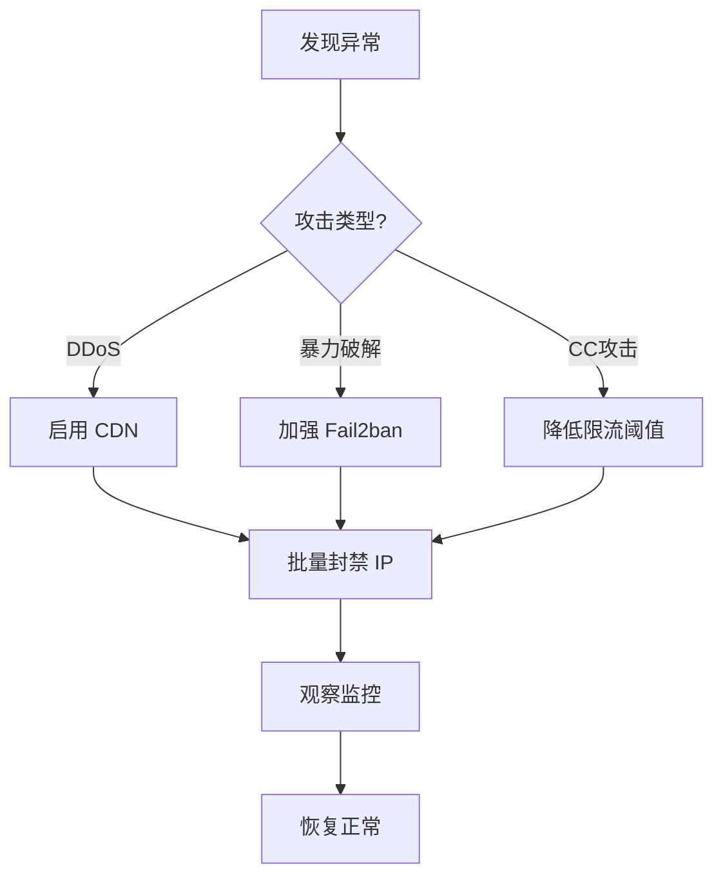

# 网站防护教程：防止攻击与流量冲击

> **环境**: OpenResty + 1Panel + Fail2ban
> **特点**: 1Panel 简化管理 + OpenResty 强大扩展能力

---

## 🎯 一、快速开始（正确的配置路径）

### 1.1 1Panel 实际功能说明

**注意**: 1Panel 没有"安全"标签和"访问限流"模块。

**1Panel 网站设置实际包含**:
| 功能 | 说明 | 是否用于防攻击 |
|-----|------|--------------|
| **流量限制** | 控制带宽/下载流量 | ❌ 不是请求频率限制 |
| **防盗链** | 防止资源被其他网站引用 | ✅ 可用 |
| **密码访问** | 网站访问需密码 | ⚠️ 仅基础保护 |
| **HTTPS** | SSL 证书配置 | ✅ 必须 |
| **配置文件** | 编辑 nginx 配置 | ✅ **核心入口** |

### 1.2 正确的防护配置流程


**关键路径**:
```
1Panel → 网站 → 选择网站 → 配置文件 → 编辑 nginx 配置
```

---

## 二、Fail2ban 核心配置

### 2.1 通过 1Panel 安装 Fail2ban

```
1Panel 面板 → 应用商店 → 搜索 "Fail2ban" → 安装
```

**安装后的日志路径**:
```bash
# 1Panel 管理的 OpenResty 日志
/opt/1panel/apps/openresty/openresty/logs/

# 或标准 OpenResty 日志
/usr/local/openresty/nginx/logs/
```

### 2.2 通过 1Panel 编辑 Fail2ban 配置

```
应用 → 已安装 → Fail2ban → 配置编辑
```

找到 `jail.d/` 目录，创建或编辑 `website-protection.conf`:

```ini
[DEFAULT]
# 封禁时间（秒）
bantime = 3600

# 检测时间窗口（秒）
findtime = 600

# 触发阈值
maxretry = 10

# 忽略IP（白名单）
ignoreip = 127.0.0.1/8 ::1

# ========== OpenResty 限流检测 ==========
[openresty-req-limit]
enabled = true
filter = nginx-req-limit
action = iptables-multiport[name=ReqLimit, port="http,https", protocol=tcp]
logpath = /opt/1panel/apps/openresty/openresty/logs/*error.log
         /usr/local/openresty/nginx/logs/*error.log
maxretry = 5
findtime = 60
bantime = 1800

# ========== OpenResty 恶意扫描 ==========
[openresty-badbots]
enabled = true
filter = nginx-badbots
action = iptables-multiport[name=BadBots, port="http,https", protocol=tcp]
logpath = /opt/1panel/apps/openresty/openresty/logs/*access.log
         /usr/local/openresty/nginx/logs/*access.log
maxretry = 2
findtime = 600
bantime = 86400

# ========== OpenResty 404 扫描 ==========
[openresty-noscript]
enabled = true
filter = nginx-noscript
action = iptables-multiport[name=NoScript, port="http,https", protocol=tcp]
logpath = /opt/1panel/apps/openresty/openresty/logs/*access.log
         /usr/local/openresty/nginx/logs/*access.log
maxretry = 3
findtime = 300
bantime = 7200

# ========== SSH 保护 ==========
[sshd]
enabled = true
port = ssh
filter = sshd
logpath = /var/log/auth.log
maxretry = 3
findtime = 300
bantime = 3600
```

### 2.3 创建自定义过滤器

在 1Panel 中:
```
应用 → Fail2ban → 配置编辑 → filter.d/nginx-req-limit.conf
```

```ini
[Definition]
failregex = limiting requests, excess:.* by zone.*client: <HOST>
            limiting requests, exceed.* by zone.*client: <HOST>
            [error] \d+#\d+: \*\d+ limiting requests.*client: <HOST>
ignoreregex =
```

### 2.4 重启并验证

```
应用 → Fail2ban → 重启
```

或在终端执行:
```bash
# 查看状态
fail2ban-client status

# 查看特定 jail 状态
fail2ban-client status openresty-req-limit

# 解封 IP
fail2ban-client set openresty-req-limit unbanip 1.2.3.4
```

---

## 三、OpenResty 限流配置（通过 1Panel 编辑）

### 3.1 【推荐】一键应用到所有网站

**方法：编辑主配置文件，全局启用限流**

```
1Panel → 网站 → 配置文件 → 主配置（nginx.conf）
```

找到 `http` 块，在**最顶部**添加以下内容：

```nginx
http {
    # ========== 全局限流区域定义 ==========
    # 基于 IP 的限流：每秒 10 个请求
    limit_req_zone $binary_remote_addr zone=global_limit:10m rate=10r/s;

    # 登录/接口严格限流：每秒 5 个请求
    limit_req_zone $binary_remote_addr zone=strict_limit:10m rate=5r/s;

    # 全局并发连接限制
    limit_conn_zone $binary_remote_addr zone=conn_limit:10m;

    # ========== 全局限流规则文件 ==========
    # 将 include 指令放在 http 块的末尾，在所有 server 块之后
    # 这样可以让限流自动应用到所有网站
    include /opt/1panel/apps/openresty/openresty/conf.d/rate-limit.conf;
}
```

**然后创建限流规则文件**：

```bash
# 创建限流规则文件
nano /opt/1panel/apps/openresty/openresty/conf.d/rate-limit.conf
```

```nginx
# ========== 全局限流规则（自动应用到所有网站） ==========
# 这个文件会被主配置文件 include，对所有 server 生效

# 创建一个通用的 location 规则
# 注意：这个方法使用 map 和 if 条件来实现全局限流
```

**⚠️ 更简单的方案**：直接在每个网站配置中添加限流

由于 nginx 的 `limit_req` 指令必须在 location/server 块中使用，**最简单的方法**是：

1. 在 `http` 块中定义限流区域（只需一次）
2. 在每个网站的 server 配置中添加一行限流指令

**示例模板**（可复制到所有网站）：

```nginx
http {
    # 限流区域定义（主配置中只需配置一次）
    limit_req_zone $binary_remote_addr zone=global_limit:10m rate=10r/s;
    limit_conn_zone $binary_remote_addr zone=conn_limit:10m;

    # 每个网站的 server 块中添加：
    server {
        listen 80;
        server_name example.com;

        # === 复制这3行到所有网站 ===
        limit_req zone=global_limit burst=20 nodelay;
        limit_conn conn_limit 10;
        limit_req_status 429;

        # 其他原有配置...
        root /www/wwwroot/example.com;
        index index.html;
    }
}
```

### 3.2 通过 1Panel 编辑单个网站配置

```
1Panel → 网站 → 选择网站 → 配置文件
```

找到 `http` 块，添加限流配置：

```nginx
http {
    # ========== 限流区域定义 ==========
    # 基于 IP 的限流：每秒 10 个请求
    limit_req_zone $binary_remote_addr zone=general_limit:10m rate=10r/s;

    # 登录接口严格限流：每秒 3 个请求
    limit_req_zone $binary_remote_addr zone=login_limit:10m rate=3r/s;

    # 并发连接限制
    limit_conn_zone $binary_remote_addr zone=conn_limit:10m;

    server {
        listen 80;
        server_name example.com;

        # 全局并发连接限制：单IP最多5个连接
        limit_conn conn_limit 5;

        # 全局请求速率限制
        limit_req zone=general_limit burst=20 nodelay;

        # 自定义限流响应
        limit_req_status 429;

        # 网站根目录
        root /www/wwwroot/example.com;
        index index.html index.php;

        # 登录接口特殊限制
        location /admin/login {
            limit_req zone=login_limit burst=5 nodelay;
            # ... 其他配置
        }

        # API 接口限制
        location /api/ {
            limit_req zone=login_limit burst=10 nodelay;
            # ... 其他配置
        }

        # 自定义 429 响应页面
        error_page 429 /429.html;
        location = /429.html {
            return 429 '{"error": "Too many requests, please slow down"}';
            add_header Content-Type application/json;
        }
    }
}
```

### 3.2 限流参数说明

| 参数             | 说明          | 推荐值                   |
| -------------- | ----------- | --------------------- |
| `rate`         | 每秒请求数       | 普通页面 10r/s，API 3-5r/s |
| `burst`        | 突发缓冲区       | rate 的 2-3 倍          |
| `nodelay`      | 不延迟处理 burst | 生产环境必须开启              |
| `zone=...:10m` | 共享内存大小      | 1M 可存约 1.6万 个IP       |

### 3.3 IP 黑名单配置

在 `http` 块中添加：

```nginx
http {
    # ========== IP 黑名单 ==========
    geo $blocked_ips {
        default 0;
        1.2.3.4 1;        # 单个 IP
        5.6.0.0/16 1;     # IP 段
    }

    server {
        # 黑名单直接返回 403
        if ($blocked_ips) {
            return 403 "Your IP has been blocked";
        }

        # 其他配置...
    }
}
```

### 3.4 User-Agent 过滤

```nginx
http {
    # 屏蔽恶意爬虫和空 UA
    map $http_user_agent $blocked_ua {
        default 0;
        ~*(?:curl|wget|python|scanner|hack) 1;
        ~*(?:spider|crawler|bot|scan) 1;
        "" 1;                                  # 空 UA
        ~*^-?$ 1;                              # 只有横线
    }

    server {
        if ($blocked_ua) {
            return 403 "Forbidden User-Agent";
        }

        # 其他配置...
    }
}
```

---

## 四、OpenResty Lua 高级限流（更强大）

### 4.0 【终极方案】一次配置，所有网站自动生效

**原理**：使用 OpenResty 的 Lua 脚本能力，在 `http` 块中全局启用限流，无需修改每个网站配置！

#### 配置步骤

**Step 1: 创建全局 Lua 限流脚本**

```bash
# 创建限流脚本目录
mkdir -p /opt/1panel/apps/openresty/openresty/lua

# 创建限流脚本
nano /opt/1panel/apps/openresty/openresty/lua/global_rate_limit.lua
```

```lua
-- global_rate_limit.lua
-- 全局限流脚本（自动应用到所有网站）

local _M = {}

-- 共享内存字典（在 nginx.conf 中定义）
local limit_dict = ngx.shared.rate_limit

-- 限流配置
local CONFIG = {
    -- 普通请求：每秒 10 次，burst 20
    normal = {rate = 10, burst = 20},

    -- 严格路径：每秒 3 次（登录、API 等）
    strict = {rate = 3, burst = 5},

    -- 并发连接：每个 IP 最多 10 个连接
    conn_limit = 10,

    -- 白名单 IP（不限流）
    whitelist = {
        ["127.0.0.1"] = true,
        ["::1"] = true,
    },

    -- 严格限流的路径前缀
    strict_paths = {
        ["/api/"] = true,
        ["/admin/"] = true,
        ["/login"] = true,
        ["/wp-login.php"] = true,
    }
}

-- 检查是否为严格限流路径
local function is_strict_path(uri)
    for prefix, _ in pairs(CONFIG.strict_paths) do
        if uri:sub(1, #prefix) == prefix then
            return true
        end
    end
    return false
end

-- 令牌桶算法限流
local function rate_limit(key, rate, burst)
    local now = ngx.now()
    local key_info = limit_dict:get(key)

    -- 初始化令牌桶
    if not key_info then
        local info = {tokens = burst, last_time = now}
        limit_dict:set(key, cjson.encode(info), 3600)
        return true
    end

    local info = cjson.decode(key_info)
    local elapsed = now - info.last_time

    -- 补充令牌
    info.tokens = math.min(burst, info.tokens + elapsed * rate)
    info.last_time = now

    -- 消耗令牌
    if info.tokens >= 1 then
        info.tokens = info.tokens - 1
        limit_dict:set(key, cjson.encode(info), 3600)
        return true
    else
        limit_dict:set(key, cjson.encode(info), 3600)
        return false
    end
end

-- 并发连接限流
local function conn_limit(ip)
    local conn_key = "conn:" .. ip
    local current, err = limit_dict:incr(conn_key, 1, 0)

    if not current then
        limit_dict:set(conn_key, 1, 60)
        return true
    end

    if current > CONFIG.conn_limit then
        return false
    end

    -- 请求结束时递减（在 log 阶段）
    return true
end

-- 主限流函数
function _M.limit()
    local ip = ngx.var.remote_addr
    local uri = ngx.var.uri

    -- 白名单检查
    if CONFIG.whitelist[ip] then
        return
    end

    -- 并发连接限制
    if not conn_limit(ip) then
        ngx.status = 429
        ngx.header["Content-Type"] = "application/json; charset=utf-8"
        ngx.say('{"error": "Too many connections", "code": 429}')
        ngx.exit(429)
        return
    end

    -- 请求速率限制
    local is_strict = is_strict_path(uri)
    local config = is_strict and CONFIG.strict or CONFIG.normal
    local key = "rate:" .. ip .. (is_strict and ":strict" or ":normal")

    if not rate_limit(key, config.rate, config.burst) then
        ngx.status = 429
        ngx.header["Content-Type"] = "application/json; charset=utf-8"
        ngx.say('{"error": "Too many requests, please slow down", "code": 429}')
        ngx.exit(429)
        return
    end
end

return _M
```

**Step 2: 编辑主配置文件**

```
1Panel → 网站 → 配置文件 → 主配置（nginx.conf）
```

在 `http {` 块的**开头**添加：

```nginx
http {
    # ========== Lua 全局限流配置（一次配置，所有网站生效）==========

    # 共享内存：存储限流状态
    lua_shared_dict rate_limit 20m;

    # 指定 Lua 脚本路径
    lua_package_path "/opt/1panel/apps/openresty/openresty/lua/?.lua;;";

    # 全局限流：在所有请求处理前执行
    init_by_lua_block {
        -- 预加载限流模块
        require("global_rate_limit")
    }

    # 在每个请求的 access 阶段执行限流检查
    # 这会应用到所有 server、所有 location！
    access_by_lua_block {
        local rate_limit = require("global_rate_limit")
        rate_limit.limit()
    }

    # 请求结束时清理连接计数
    log_by_lua_block {
        local ip = ngx.var.remote_addr
        local dict = ngx.shared.rate_limit
        local conn_key = "conn:" .. ip
        dict:incr(conn_key, -1)
    }

    # ========== 以上配置完成后，所有网站自动生效限流 ==========
    # ========== 无需修改任何单个网站的配置 ==========

    # 其他原有配置...
}
```

**Step 3: 重载配置**

```bash
# 测试配置
openresty -t

# 重载
openresty -s reload
```

**Step 4: 验证生效**

```bash
# 测试限流（快速发送 20 个请求）
for i in {1..20}; do curl -I http://你的域名; done

# 查看共享内存状态
curl http://localhost/nginx_status 2>/dev/null || echo "需启用 stub_status 模块"
```

#### 配置说明

| 配置项 | 说明 | 默认值 |
|--------|------|--------|
| 普通请求限流 | 每秒请求数 | 10 req/s |
| 严格路径限流 | API/登录等每秒请求数 | 3 req/s |
| 并发连接 | 单 IP 最大连接数 | 10 |
| 共享内存 | 限流状态存储 | 20M |

#### 自定义配置

编辑 `/opt/1panel/apps/openresty/openresty/lua/global_rate_limit.lua` 中的 `CONFIG` 部分：

```lua
local CONFIG = {
    -- 调整普通请求限流
    normal = {rate = 20, burst = 40},  -- 改为每秒 20 次

    -- 调整严格限流
    strict = {rate = 5, burst = 10},   -- 改为每秒 5 次

    -- 添加白名单 IP
    whitelist = {
        ["127.0.0.1"] = true,
        ["你的IP"] = true,  -- 添加你的 IP
    },

    -- 添加严格限流路径
    strict_paths = {
        ["/api/"] = true,
        ["/admin/"] = true,
        ["/你的路径"] = true,  -- 添加新路径
    }
}
```

#### 优势对比

| 特性 | 传统 limit_req | Lua 全局限流 |
|------|---------------|--------------|
| 一次配置全部生效 | ❌ 需要 | ✅ 是 |
| 需修改每个网站 | ✅ 是 | ❌ 不需要 |
| 动态调整 | ❌ 需重载 | ✅ 是（修改脚本即可） |
| 精确控制路径 | ⚠️ 需逐个配置 | ✅ 配置一次 |
| 统计监控 | ⚠️ 困难 | ✅ 可扩展 |

---

### 4.1 创建 Lua 限流脚本（Redis 版本）

通过 1Panel 或终端创建文件：

```bash
# 路径示例
mkdir -p /opt/1panel/apps/openresty/openresty/lua
nano /opt/1panel/apps/openresty/openresty/lua/rate_limit.lua
```

```lua
-- rate_limit.lua
local redis = require "resty.redis"
local red = redis:new()

red:set_timeout(1000)

local ok, err = red:connect("127.0.0.1", 6379)
if not ok then
    ngx.log(ngx.ERR, "Redis connection failed: ", err)
    return
end

local client_ip = ngx.var.remote_addr
local key = "rate_limit:" .. client_ip

-- 递增计数
local requests, err = red:incr(key)

if requests == 1 then
    red:expire(key, 60)  -- 60 秒窗口
end

-- 限流：1 分钟最多 100 次
if requests > 100 then
    ngx.status = 429
    ngx.say("Too many requests")
    ngx.exit(429)
end
```

### 4.2 在 nginx.conf 中调用

```nginx
http {
    lua_shared_dict limit_counter 10m;
    lua_package_path "/opt/1panel/apps/openresty/openresty/lua/?.lua;;";

    server {
        location / {
            access_by_lua_block {
                require("rate_limit")
            }
        }
    }
}
```

---

## 五、一键部署 WAF（推荐方案）

### 5.1 安装雷池 SafeLine WAF

```
1Panel → 应用商店 → 搜索 "雷池" 或 "SafeLine" → 安装
```

**雷池 WAF 功能**:
- ✅ 自动防护 SQL 注入、XSS、CC 攻击
- ✅ 图形化管理界面
- ✅ 实时攻击日志分析
- ✅ 一键封禁恶意 IP

### 5.2 配置 WAF 代理

安装后，将网站流量经过 WAF：

```nginx
server {
    listen 80;
    server_name example.com;

    # 反向代理到 WAF（端口根据实际安装调整）
    location / {
        proxy_pass http://127.0.0.1:9443;
        proxy_set_header Host $host;
        proxy_set_header X-Real-IP $remote_addr;
    }
}
```

---

## 六、监控与诊断

### 6.1 1Panel 内置监控

```
网站 → 选择网站 → 监控
```

### 6.2 快速诊断命令

```bash
# 查看当前连接最多的 IP
netstat -ntu | awk '{print $5}' | cut -d: -f1 | sort | uniq -c | sort -nr | head -20

# 查看 OpenResty 状态（需启用 stub_status）
curl http://localhost/nginx_status

# 实时查看错误日志
tail -f /opt/1panel/apps/openresty/openresty/logs/error.log

# 查看 Fail2ban 封禁状态
fail2ban-client status openresty-req-limit
```

---

## 七、应急响应流程

### 攻击处理流程



### 快速应急操作

| 紧急情况 | 操作 |
|---------|------|
| 网站被刷 | 编辑 nginx 配置，降低 `rate` 值为 `1r/s` |
| 恶意 IP | 在 `geo $blocked_ips` 中添加 |
| 暴力破解 | Fail2ban 降低 `maxretry` 为 `2` |
| 流量暴增 | 启用 Cloudflare CDN |

### 快速命令

```bash
# 立即封禁单个 IP
iptables -A INPUT -s 1.2.3.4 -j DROP

# 封禁 IP 段
iptables -A INPUT -s 1.2.3.0/24 -j DROP

# 查看封禁列表
iptables -L INPUT -n -v | grep DROP

# 解除封禁
iptables -D INPUT -s 1.2.3.4 -j DROP

# 重载 OpenResty（不中断服务）
openresty -s reload

# Fail2ban 手动封禁
fail2ban-client set openresty-req-limit banip 1.2.3.4

# Fail2ban 解封
fail2ban-client set openresty-req-limit unbanip 1.2.3.4
```

---

## 八、推荐配置方案

### 方案 A：小流量网站（推荐）

| 功能 | 配置方式 |
|-----|---------|
| 请求限流 | nginx 配置 `limit_req` |
| IP 黑名单 | nginx `geo` 模块 |
| Fail2ban | 1Panel 商店安装 |
| HTTPS | 1Panel 内置 Let's Encrypt |
| CDN | Cloudflare 免费版 |

### 方案 B：中流量网站

| 功能 | 配置方式 |
|-----|---------|
| 智能限流 | OpenResty + Redis Lua 脚本 |
| WAF | 雷池 SafeLine |
| 监控 | 1Panel 内置监控 |
| CDN | 阿里云/腾讯云 CDN |

### 方案 C：高防网站

| 功能 | 配置方式 |
|-----|---------|
| DDoS 防护 | 高防 IP / 高防 CDN |
| WAF | 雷池企业版 |
| 监控 | Grafana + Prometheus |

---

## 九、配置检查清单

### 基础防护
- [ ] Fail2ban 已安装（1Panel 商店）
- [ ] nginx 限流已配置（配置文件编辑）
- [ ] SSL 证书已启用
- [ ] 隐藏服务器版本信息

### 高级防护
- [ ] Lua 限流脚本已部署（可选）
- [ ] WAF 已安装（雷池 SafeLine）
- [ ] 监控已配置
- [ ] 备份计划已设置

---

## 十、常见问题

### Q1: 1Panel 日志路径在哪里？

```bash
# 1Panel OpenResty 默认路径
/opt/1panel/apps/openresty/openresty/logs/
```

### Q2: 如何查看实时日志？

```bash
# 方式一：终端
tail -f /opt/1panel/apps/openresty/openresty/logs/access.log

# 方式二：1Panel 界面
网站 → 选择网站 → 日志
```

### Q3: 配置修改后如何生效？

```bash
# 方式一：1Panel 界面
网站 → 配置文件 → 保存后自动重载

# 方式二：命令行
openresty -s reload
```

### Q4: 如何批量封禁 IP？

在 nginx 配置中：
```nginx
geo $blocked_ips {
    default 0;
    1.2.3.4 1;
    5.6.7.8 1;
    9.10.0.0/16 1;
}
```

### Q5: 不用脚本，一次修改对所有网站生效？

**注意**：传统的 nginx `limit_req` 指令**无法**像 Lua 那样实现真正的"一次配置永久生效"，因为它必须在 server 块中使用。

**最接近的解决方案**：

---

#### 方法一：修改 1Panel 网站配置模板（推荐）

**原理**：修改 1Panel 生成网站配置的模板，让所有新建网站自动包含限流配置。

```bash
# 1. 找到 1Panel 的网站配置模板
# 通常位于 1Panel 安装目录下
cd /opt/1panel

# 2. 搜索模板文件（可能的位置）
find . -name "*.tmpl" -o -name "*.tpl" | grep -i nginx
find . -path "*/openresty/*" -name "*template*"

# 3. 编辑模板文件
# 找到类似这样的模板文件：
# conf.d/site.conf.tmpl  或  openresty/conf.d/site.tmpl
nano <找到的模板文件路径>
```

在模板的 `server {` 块中添加限流配置：

```nginx
server {
    listen {{PORT}};
    server_name {{DOMAIN}};

    # === 限流配置（添加到模板中）===
    limit_req zone=global_limit burst=20 nodelay;
    limit_conn conn_limit 10;
    limit_req_status 429;

    # 其他原有配置...
}
```

**效果**：之后创建的新网站会自动包含限流配置。

---

#### 方法二：批量修改现有网站（一次性）

```bash
# 备份配置
cp -r /opt/1panel/apps/openresty/openresty/conf.d /opt/1panel/apps/openresty/openresty/conf.d.bak.$(date +%Y%m%d)

# 批量添加限流到所有网站
cd /opt/1panel/apps/openresty/openresty/conf.d/
for file in *.conf; do
    # 检查是否已有限流配置
    if ! grep -q "limit_req" "$file"; then
        # 在第一个 server { 后添加限流
        sed -i '0,/server {/s//server {\n        # 限流配置\n        limit_req zone=global_limit burst=20 nodelay;\n        limit_conn conn_limit 10;\n        limit_req_status 429;/' "$file"
        echo "✓ 已添加限流: $file"
    else
        echo "⊘ 已有限流: $file"
    fi
done

# 测试配置
openresty -t

# 如果测试通过，重载
openresty -s reload
```

---

#### 方法三：一键配置脚本（最简单）

```bash
#!/bin/bash
# 一键为所有网站添加限流

# 配置参数
RATE_LIMIT_ZONE="global_limit"
BURST=20
CONN_LIMIT=10

# 主配置中定义限流区域
MAIN_CONF="/opt/1panel/apps/openresty/openresty/conf/nginx.conf"

# 检查主配置中是否已定义限流区域
if ! grep -q "limit_req_zone.*global_limit" "$MAIN_CONF"; then
    echo "正在主配置中添加限流区域定义..."
    # 在 http 块中添加（需要手动编辑，或使用 sed）
    echo "请在主配置的 http { 块中添加以下内容："
    echo "limit_req_zone \$binary_remote_addr zone=global_limit:10m rate=10r/s;"
    echo "limit_conn_zone \$binary_remote_addr zone=conn_limit:10m;"
    read -p "按回车继续..."
fi

# 批量添加到所有网站
CONF_DIR="/opt/1panel/apps/openresty/openresty/conf.d"
COUNT=0

for conf in "$CONF_DIR"/*.conf; do
    if ! grep -q "limit_req" "$conf"; then
        sed -i '0,/server {/s//server {\n        limit_req zone=global_limit burst=20 nodelay;\n        limit_conn conn_limit 10;\n        limit_req_status 429;/' "$conf"
        ((COUNT++))
    fi
done

echo "已为 $COUNT 个网站添加限流配置"
openresty -t && openresty -s reload
```

保存为 `/usr/local/bin/add-rate-limit.sh`，使用：

```bash
chmod +x /usr/local/bin/add-rate-limit.sh
add-rate-limit.sh
```

---

#### 总结

| 方法 | 优点 | 缺点 | 适用场景 |
|------|------|------|----------|
| **修改模板** | 新网站自动生效 | 需找到模板文件 | 经常创建新网站 |
| **批量修改** | 一次性处理现有网站 | 需要执行脚本 | 有多个现有网站 |
| **一键脚本** | 最简单，自动处理 | 需要运行脚本 | 快速部署 |

**重要提醒**：
- 传统 nginx `limit_req` 无法做到真正的"一次配置永久生效"
- 如需真正的全局限流，请使用 **Lua 方案**（见第四节 4.0）

---

## 附录A：限流配置快速应用指南

### ⚡ 5分钟完成全站限流配置

---

#### 🌟 方案选择

| 方案 | 适用场景 | 是否需要改每个网站 |
|------|----------|-------------------|
| **方案一：Lua 全局限流** | **推荐！** 一次配置，所有网站永久生效 | ❌ 不需要 |
| **方案二：传统 limit_req** | 不想用 Lua，手动控制每个网站 | ⚠️ 需要每个网站添加 3 行 |

---

#### 方案一：Lua 全局限流（推荐，一次搞定）

**优势**：
- ✅ 只需在主配置添加一次
- ✅ 所有现有和新建网站自动生效
- ✅ 自动识别 API/登录路径并严格限流
- ✅ 无需修改任何单个网站配置

**配置路径**：
```
1Panel → 网站 → 配置文件 → 主配置（nginx.conf）
```

在 `http {` 块开头添加：

```nginx
http {
    # 共享内存：存储限流状态
    lua_shared_dict rate_limit 20m;

    # 指定 Lua 脚本路径
    lua_package_path "/opt/1panel/apps/openresty/openresty/lua/?.lua;;";

    # 全局限流：在所有请求处理前执行
    init_by_lua_block {
        require("global_rate_limit")
    }

    # 在每个请求的 access 阶段执行限流检查
    access_by_lua_block {
        local rate_limit = require("global_rate_limit")
        rate_limit.limit()
    }

    # 请求结束时清理连接计数
    log_by_lua_block {
        local ip = ngx.var.remote_addr
        local dict = ngx.shared.rate_limit
        local conn_key = "conn:" .. ip
        dict:incr(conn_key, -1)
    }

    # 其他原有配置...
}
```

然后创建 Lua 脚本（详见**第四节 4.0**完整代码）：

```bash
mkdir -p /opt/1panel/apps/openresty/openresty/lua
nano /opt/1panel/apps/openresty/openresty/lua/global_rate_limit.lua
```

**完成！** 现在所有网站都有限流保护了。

---

#### 方案二：传统 limit_req（手动控制每个网站）

**Step 1: 定义限流区域（只需做一次）**

```
1Panel → 网站 → 配置文件 → 主配置（nginx.conf）
```

在 `http {` 块开头添加：

```nginx
limit_req_zone $binary_remote_addr zone=global_limit:10m rate=10r/s;
limit_conn_zone $binary_remote_addr zone=conn_limit:10m;
```

**Step 2: 为每个网站启用限流**

有两种方式：

**方式A（推荐）** - 每个网站手动添加 3 行代码：

```
1Panel → 网站 → 选择网站 → 配置文件
```

在 `server {` 块中添加：

```nginx
server {
    listen 80;
    # 添加以下 3 行
    limit_req zone=global_limit burst=20 nodelay;
    limit_conn conn_limit 10;
    limit_req_status 429;

    # ... 其他配置保持不变
}
```

**方式B（高级）** - 使用脚本批量添加：

```bash
# 编辑主配置，添加限流区域（先完成 Step 1）

# 批量添加限流到所有网站
cd /opt/1panel/apps/openresty/openresty/conf.d/
for file in *.conf; do
    # 检查是否已有限流配置
    if ! grep -q "limit_req" "$file"; then
        # 在第一个 server { 后添加限流
        sed -i '0,/server {/s//server {\n        limit_req zone=global_limit burst=20 nodelay;\n        limit_conn conn_limit 10;\n        limit_req_status 429;/' "$file"
        echo "已添加限流: $file"
    fi
done

# 测试并重载
openresty -t && openresty -s reload
```

**Step 3: 验证限流是否生效**

```bash
# 查看限流日志
tail -f /opt/1panel/apps/openresty/openresty/logs/error.log | grep limiting

# 测试限流（会返回 429）
for i in {1..20}; do curl -I http://你的域名; done
```

### 📋 快速复制模板

**方案一：Lua 全局限流（推荐）**

主配置 `http {` 块添加（一次配置，永久生效）：

```nginx
# === Lua 全局限流（推荐）===
lua_shared_dict rate_limit 20m;
lua_package_path "/opt/1panel/apps/openresty/openresty/lua/?.lua;;";
init_by_lua_block { require("global_rate_limit") }
access_by_lua_block { local r = require("global_rate_limit"); r.limit() }
log_by_lua_block { local d = ngx.shared.rate_limit; d:incr("conn:"..ngx.var.remote_addr, -1) }
```

**方案二：传统 limit_req（手动）**

每个网站 `server {` 块添加：

```nginx
# === 传统限流配置（粘贴到 server { 后）===
limit_req zone=global_limit burst=20 nodelay;
limit_conn conn_limit 10;
limit_req_status 429;
```

---

## 参考资料

- [1Panel 官方文档 - 网站配置](https://1panel.cn/docs/v1/user_manual/websites/website_config_basic/)
- [OpenResty 官方文档](https://openresty.org/cn/)
- [雷池 SafeLine WAF](https://waf-ce.chaitin.cn/)
- [Fail2ban 官方文档](https://fail2ban.readthedocs.io/)

---

> **最后更新**: 2026-02-09
> **适用版本**: 1Panel v1.10+ / OpenResty 1.25+
>
> **更正说明**: 1Panel 的"流量限制"是带宽控制，不是请求频率限制。请求频率需通过编辑 nginx 配置实现。
