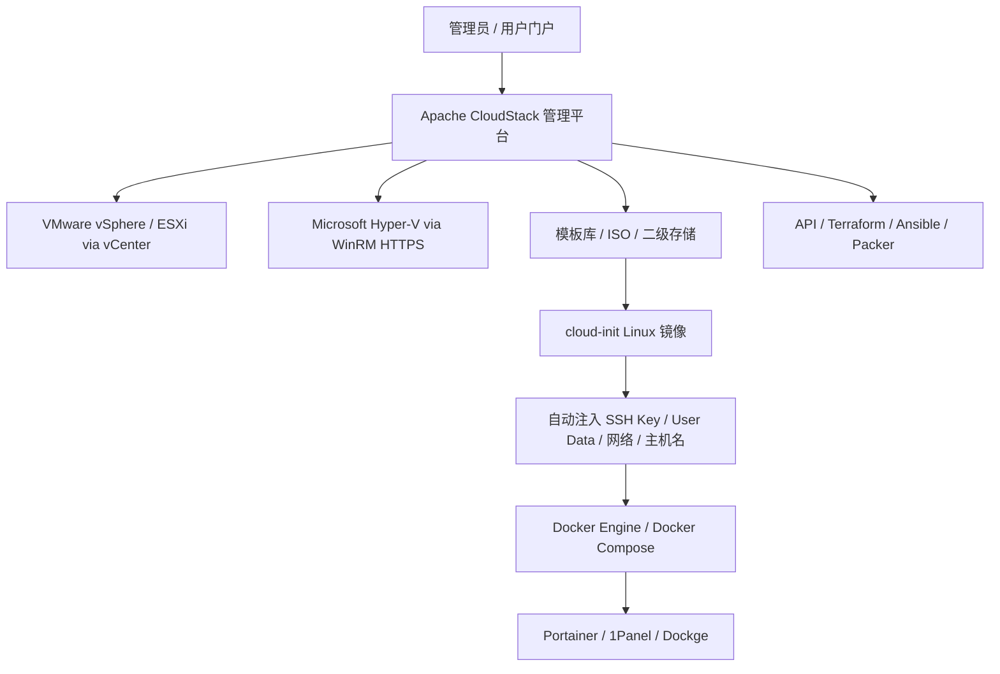
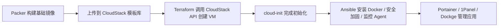

### **最匹配你需求的开源方案是：Apache CloudStack 作为统一 IaaS 管理层，配合 cloud-init 模板、Ansible/Terraform/Packer 自动化，以及 Portainer 或 1Panel 管理 Docker。**

如果你的目标是“不替换现有 ESXi 和 Hyper-V，而是在上面统一创建、初始化、管理虚拟机”，Apache CloudStack 是目前最接近的开源方案；如果你愿意逐步迁移底层虚拟化，Proxmox VE 更适合作为长期替代平台，但它不是 ESXi/Hyper-V 的统一上层管理器。

### **1. 你的需求拆解**

你现在有两个底层虚拟化平台：ESXi 和 Hyper-V。你的核心诉求其实可以分成三层：

第一层是虚拟化资源统一管理，也就是把 ESXi 和 Hyper-V 主机纳入同一个控制台，统一创建、启动、停止、删除、快照和分配网络、存储资源。

第二层是镜像标准化，也就是使用 Ubuntu、Debian、Rocky Linux、AlmaLinux 等 cloud-init 镜像，通过 user-data 自动注入 SSH Key、主机名、网络、用户、初始化脚本和软件包。

第三层是应用交付，也就是快速把 Docker、Docker Compose、Portainer、1Panel、Dockge 或 Kubernetes 节点部署到新建虚拟机中。

从这三个维度看，单纯的虚拟化管理面板不够，你需要的是一个“私有云 IaaS 管理平台 + 自动化配置 + Docker 管理面板”的组合。

### **2. 推荐架构：CloudStack + cloud-init + Docker 管理面板**

我建议你的主方案采用下面这个架构：



CloudStack 官方文档明确说明它是开源 IaaS 平台，用于编排计算、存储和网络资源，并支持多种虚拟化技术，包括 Hyper-V、KVM、LXC、vSphere via vCenter、XenServer/XCP-ng 等；同时它提供 Web UI、REST-like API、EC2 API 兼容层，并可管理模板、ISO、快照、网络、DHCP、NAT、防火墙、端口转发等资源。这一点非常符合你“统一管理 ESXi 和 Hyper-V”的目标。 [Apache CloudStack Docs](https://docs.cloudstack.apache.org/en/latest/conceptsandterminology/concepts.html)

CloudStack 4.21/4.22 文档还显示，它内置了针对 Hyper-V 的 Orchestrator Extension，Hyper-V 通过 WinRM over HTTPS 与 CloudStack 通信，可执行虚拟机创建、启动、停止、重启、删除，以及挂起、恢复、快照、恢复快照等操作；文档还要求 Hyper-V 主机开放 TCP 5986、配置 TLS 证书，并提供 vhd_path、vm_path、network_bridge 等参数。 [Apache CloudStack Docs](https://docs.cloudstack.apache.org/en/4.21.0.0/adminguide/extensions/inbuilt_extensions.html)

对于 cloud-init，CloudStack 官方文档说明其集成可以提供密码管理、SSH Key 管理、分区管理、User Data 输入等功能。也就是说，你可以把 Docker 安装脚本、初始化用户、SSH Key、Docker Compose 文件、agent 安装命令都放进 cloud-init user-data 中，实现“创建 VM 后自动变成可用的 Docker 主机”。 [Apache CloudStack Docs](https://docs.cloudstack.apache.org/en/4.21.0.0/adminguide/templates/_cloud_init.html)

### **3. 推荐选型对比**

| 方案 | 是否适合 ESXi + Hyper-V 统一管理 | cloud-init 支持 | Docker 快速部署 | 适合程度 |
|---|---:|---:|---:|---:|
| Apache CloudStack | 高，支持 vSphere 和 Hyper-V | 高 | 通过 user-data/Ansible 部署 | 最推荐 |
| OpenNebula | 更偏 KVM/Kubernetes/企业云 | 支持云初始化思路 | 可配合自动化 | 次推荐 |
| Proxmox VE | 不适合直接统一管理 ESXi/Hyper-V | 支持 cloud-init | 支持 VM/LXC，适合 Docker 主机 | 适合作为迁移目标 |
| OpenStack | 能力强但复杂度高 | 高 | 适合大规模云平台 | 仅适合团队较大场景 |
| 仅 Portainer/1Panel | 不管理虚拟化平台 | 无 | 很强 | 只能管 Docker，不能管 VM |

Proxmox VE 本身是优秀的开源虚拟化平台，官方说明它集成 KVM 虚拟机、LXC 容器、软件定义存储和网络，并通过 Web UI 管理 VM、容器、HA 集群和灾备工具；但它的定位更像“替代 ESXi/Hyper-V 的底层虚拟化平台”，而不是在现有 ESXi 和 Hyper-V 之上做统一控制台。它适合你未来逐步迁移或新建资源池。 [Proxmox](https://www.proxmox.com/en/products/proxmox-virtual-environment/overview)

OpenNebula 官方定位是开源云与虚拟化管理平台，强调统一管理 KVM 虚拟机和 Kubernetes 集群，适合企业云、边缘云和混合云场景；不过从你的需求看，Hyper-V 不是它当前主线优势，公开资料中 Hyper-V 集成更多体现为早期原型或生态项目，因此如果你现在明确要同时管理 ESXi 和 Hyper-V，CloudStack 更稳妥。 [OpenNebula](https://opennebula.io/platform/)

### **4. 为什么不建议把 Docker Desktop 跑在虚拟机里作为主方案**

如果你的 Docker 目标是服务器侧部署，我建议直接在 Linux VM 内安装 Docker Engine，而不是在 Windows VM 里跑 Docker Desktop。Docker 官方文档说明，在 VM/VDI 环境中运行 Docker Desktop 通常依赖嵌套虚拟化；其支持范围和底层虚拟化平台有关，且 Docker Desktop 在虚拟桌面环境中的支持条件较严格。对于服务器场景，Linux VM + Docker Engine + Docker Compose/Portainer/1Panel 更简单、稳定、可自动化。 [Docker Docs](https://docs.docker.com/desktop/setup/vm-vdi/)

### **5. 具体落地方案**

#### **第 1 步：把 CloudStack 作为统一控制面**

建议先部署一个 CloudStack Management Server，后端使用 MySQL/MariaDB，前端通过 CloudStack Web UI 和 API 统一管理资源。你的 ESXi 不建议直接裸接单台 ESXi，而是通过 vCenter 纳入 CloudStack，因为 CloudStack 官方文档中 vSphere 是通过 vCenter 管理的。Hyper-V 则按 CloudStack 文档配置 WinRM over HTTPS。

在 CloudStack 里，建议按机房或资源池规划 Zone；按网络或机架规划 Pod；按虚拟化类型规划 Cluster。例如：

```text
Zone-01
├── Pod-01
│   ├── Cluster-vSphere
│   │   └── ESXi hosts via vCenter
│   └── Cluster-HyperV
│       └── Hyper-V hosts via WinRM HTTPS
```

这样做的好处是：上层用户只看 CloudStack 的计算规格、模板、网络和实例，不需要关心底层到底是 ESXi 还是 Hyper-V。

#### **第 2 步：统一网络模型**

如果你要同时管理 ESXi 和 Hyper-V，网络规划比平台安装更关键。CloudStack 的高级网络通常依赖 VLAN 隔离、虚拟路由器、DHCP、NAT、端口转发、防火墙规则等机制。CloudStack 文档中也说明，Hyper-V 和 Proxmox 扩展都要求主机和 CloudStack hypervisor hosts 通过 VLAN trunk 网络连接，虚拟机启动后通过 VLAN-tagged DHCP 请求获得 CloudStack Virtual Router 分配的地址。 [Apache CloudStack Docs](https://docs.cloudstack.apache.org/en/4.21.0.0/adminguide/extensions/inbuilt_extensions.html)

建议至少划分这些网络：

```text
Management Network：CloudStack、vCenter、Hyper-V、宿主管理通信
Guest Network：虚拟机业务网络，建议 VLAN 隔离
Public Network：对外访问、NAT、端口转发、负载均衡
Storage Network：模板、ISO、快照、主存储、二级存储访问
```

如果你只是中小规模私有环境，可以先用 Basic Network 或简化版 Advanced Network；如果后续要多租户、隔离环境、开发/测试/生产分离，建议一开始就采用 Advanced Network。

#### **第 3 步：准备 cloud-init 模板**

建议先准备 2 到 4 个标准模板：

```text
Ubuntu 24.04 LTS cloud-init template
Debian 12 cloud-init template
Rocky Linux 9 cloud-init template
AlmaLinux 9 cloud-init template
```

模板里只放基础内容：

```text
cloud-init
qemu-guest-agent / open-vm-tools / hyperv-daemons
openssh-server
curl
wget
ca-certificates
python3
sudo
chrony
```

然后通过 CloudStack 的 user-data 动态安装 Docker，而不是把 Docker 固化在基础镜像里。这样镜像更干净，也方便后续升级 Docker 版本。

一个典型的 cloud-init user-data 可以是：

```yaml
#cloud-config
hostname: docker-node-01
manage_etc_hosts: true

users:
  - name: ops
    groups: sudo, docker
    shell: /bin/bash
    sudo: ['ALL=(ALL) NOPASSWD:ALL']
    ssh_authorized_keys:
      - ssh-ed25519 AAAA你的公钥

package_update: true
package_upgrade: true

packages:
  - ca-certificates
  - curl
  - gnupg
  - lsb-release

runcmd:
  - install -m 0755 -d /etc/apt/keyrings
  - curl -fsSL https://download.docker.com/linux/ubuntu/gpg -o /etc/apt/keyrings/docker.asc
  - chmod a+r /etc/apt/keyrings/docker.asc
  - echo "deb [arch=$(dpkg --print-architecture) signed-by=/etc/apt/keyrings/docker.asc] https://download.docker.com/linux/ubuntu $(. /etc/os-release && echo $VERSION_CODENAME) stable" > /etc/apt/sources.list.d/docker.list
  - apt-get update
  - apt-get install -y docker-ce docker-ce-cli containerd.io docker-buildx-plugin docker-compose-plugin
  - systemctl enable --now docker
  - usermod -aG docker ops
```

如果你要自动部署 Portainer，可以继续追加：

```yaml
  - docker volume create portainer_data
  - docker run -d --name portainer --restart=always -p 9443:9443 -v /var/run/docker.sock:/var/run/docker.sock -v portainer_data:/data portainer/portainer-ce:latest
```

如果你更偏中文运维面板和应用商店，可以用 1Panel；如果你主要管理 Docker Compose 堆栈，可以用 Dockge；如果你管理多个 Docker 主机和团队权限，Portainer 更适合。

#### **第 4 步：用 Packer 做镜像，用 Terraform/Ansible 做交付**

为了避免手工维护模板，我建议采用下面的流水线：



CloudStack 提供 API，官方文档也说明其管理服务器提供 Web 界面和 API，并负责实例分配、IP 分配、存储分配、模板、ISO、快照等管理。这样你可以把 VM 创建从“点控制台”升级为“基础设施即代码”。 [Apache CloudStack Docs](https://docs.cloudstack.apache.org/en/latest/conceptsandterminology/concepts.html)

推荐工具组合如下：

```text
Packer：构建 Ubuntu/Debian/Rocky/Alma cloud-init 模板
Terraform：调用 CloudStack API 创建 VM、网络、磁盘、防火墙规则
Ansible：安装 Docker、配置 daemon.json、部署监控、安全加固
Portainer：统一管理 Docker 主机、Stack、容器、镜像、网络、卷
1Panel：适合中文化服务器运维和应用商店
Dockge：轻量级 Docker Compose 栈管理
Prometheus + Grafana：监控 VM 和 Docker
Loki / ELK：日志收集
```

### **6. 最推荐的组合方案**

#### **方案 A：保留 ESXi + Hyper-V，做统一管理**

这是最贴合你当前环境的方案。

```text
Apache CloudStack
+ vCenter 管理 ESXi
+ WinRM HTTPS 管理 Hyper-V
+ cloud-init 模板
+ Terraform / Ansible
+ Portainer 或 1Panel 管理 Docker
```

适合场景：

```text
已有 ESXi 和 Hyper-V，不想马上迁移
希望统一创建 VM
希望通过 cloud-init 快速初始化 Linux
希望 VM 创建后自动部署 Docker
需要 Web UI + API
需要多租户、资源配额、网络隔离
```

优点是最符合你的现状；缺点是 CloudStack 的网络、存储、Zone/Pod/Cluster 概念需要认真规划，初始学习成本比 Proxmox 高。

#### **方案 B：逐步迁移到 Proxmox VE**

如果你愿意减少 ESXi 和 Hyper-V 的长期维护成本，可以把 Proxmox VE 作为新资源池：

```text
Proxmox VE Cluster
+ Proxmox Backup Server
+ cloud-init VM templates
+ LXC / KVM
+ Ansible / Terraform
+ Portainer / 1Panel
```

Proxmox 的优势是轻量、开源、Web UI 友好、KVM 和 LXC 集成好，也有 VMware ESXi guest import 相关能力；但它不是用来统一控制现有 ESXi 和 Hyper-V 的上层平台，更适合作为迁移目的地或新建虚拟化底座。 [Proxmox](https://www.proxmox.com/en/products/proxmox-virtual-environment/overview)

#### **方案 C：大规模私有云采用 OpenStack**

如果你未来是几十上百台物理机、大规模多租户、强 API、强网络能力、团队有专门云平台工程师，可以考虑 OpenStack。但如果只是工程团队、研发测试、企业内部私有云，OpenStack 的组件复杂度、运维成本和排障难度通常偏高。

### **7. 你可以按这个顺序实施**

第一阶段先做 PoC，不建议一开始全量接管生产环境。先准备 1 台 CloudStack Management Server、1 个测试 vCenter/ESXi Cluster、1 台测试 Hyper-V 主机、1 套 NFS/SMB 存储、1 个测试 VLAN。目标是验证 CloudStack 能否创建 VM、启动 VM、分配 IP、注入 cloud-init user-data。

第二阶段做模板标准化。先完成 Ubuntu 和 Debian 两个 cloud-init 模板，确保 SSH Key 注入、主机名设置、网络配置、磁盘扩容、Docker 自动安装都稳定。CloudStack 官方 cloud-init 文档中明确提到 password management、SSH keys management、partition management、user-data input 等能力，这些正好对应模板标准化的关键点。 [Apache CloudStack Docs](https://docs.cloudstack.apache.org/en/4.21.0.0/adminguide/templates/_cloud_init.html)

第三阶段接入 Docker 管理。小规模可以先用 1Panel 或 Dockge；多主机、多团队建议用 Portainer CE/BE。这里要注意，Docker 管理平台只管理容器层，不替代 CloudStack；CloudStack 负责创建 VM，Portainer/1Panel 负责管理 VM 里的 Docker。

第四阶段引入 IaC。用 Terraform 调 CloudStack 创建 VM，用 Ansible 做 Docker、监控、安全基线、日志 Agent 部署。之后你就可以做到：

```text
提交一个 YAML / Terraform 变量
自动创建 VM
自动注入 cloud-init
自动安装 Docker
自动注册到 Portainer
自动加入监控
自动开放端口或绑定负载均衡
```

### **8. 我建议你的最终技术栈**

按你的目标，我给出的最优组合是：

```text
统一虚拟机管理：Apache CloudStack
现有 ESXi 接入：vCenter
现有 Hyper-V 接入：WinRM over HTTPS
镜像初始化：cloud-init
镜像构建：Packer
资源编排：Terraform CloudStack Provider
配置管理：Ansible
Docker 管理：Portainer CE / 1Panel / Dockge
监控：Prometheus + Grafana + Node Exporter + cAdvisor
日志：Loki + Promtail 或 ELK
备份：底层虚拟化快照 + 应用数据卷备份 + 对象存储
```

如果你只选一个核心平台，我建议从 **Apache CloudStack** 开始；如果你愿意逐步替换底层虚拟化，则把 **Proxmox VE** 作为新集群方向。对于“ESXi + Hyper-V 统一管理 + cloud-init + Docker 快速部署”这个组合需求，CloudStack 的匹配度最高。